# AI Intelligence Protocol Flow

**Version**: 0.11.0-alpha (Epic 2)
**Last Updated**: 2026-02-08
**Status**: Future Specification
**Dependencies**: AIKit Video Epic 14 (AIKIT-126 through AIKIT-142)

## Overview

This document specifies the WebSocket message flows for the A2UI AI Intelligence Protocol (Epic 2). These extensions enable agents to leverage AIKit Video's AI+Database intelligence features, including semantic video search, AI metadata extraction, cross-device progress tracking, and personalized recommendations.

## Message Type Extensions

Epic 2 adds 8 new message types:

### Semantic Search
1. **A2UISearchVideos** (Agent → Renderer) - Search videos semantically
2. **A2UISearchResults** (Renderer → Agent) - Return search results with relevance

### AI Metadata
3. **A2UIRequestMetadata** (Agent → Renderer) - Request AI analysis
4. **A2UIVideoMetadataReady** (Renderer → Agent) - Deliver AI insights

### Progress Tracking
5. **A2UIUpdateProgress** (Renderer → Agent) - Report playback progress
6. **A2UIProgressSync** (Agent → Renderer) - Sync progress across devices

### Recommendations
7. **A2UIRequestRecommendations** (Agent → Renderer) - Request video suggestions
8. **A2UIRecommendations** (Renderer → Agent) - Deliver personalized recommendations

## Semantic Video Search Flow

### Basic Search Flow

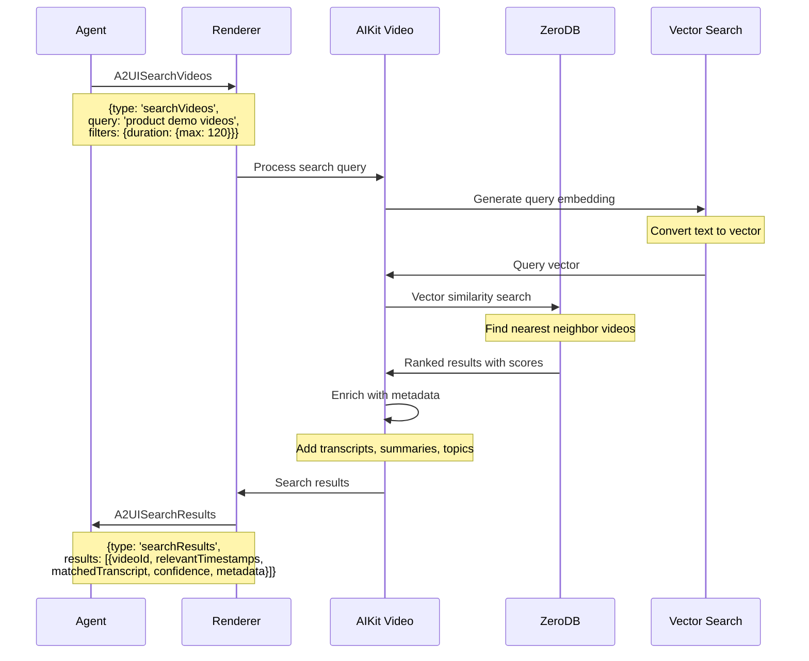
```mermaid
sequenceDiagram
    participant Agent
    participant Renderer
    participant AIKit as AIKit Video
    participant ZeroDB
    participant AI as Vector Search

    Agent->>Renderer: A2UISearchVideos
    Note over Agent,Renderer: {type: 'searchVideos',<br/>query: 'product demo videos',<br/>filters: {duration: {max: 120}}}

    Renderer->>AIKit: Process search query

    AIKit->>AI: Generate query embedding
    Note over AI: Convert text to vector

    AI->>AIKit: Query vector

    AIKit->>ZeroDB: Vector similarity search
    Note over ZeroDB: Find nearest neighbor videos

    ZeroDB->>AIKit: Ranked results with scores

    AIKit->>AIKit: Enrich with metadata
    Note over AIKit: Add transcripts, summaries, topics

    AIKit->>Renderer: Search results

    Renderer->>Agent: A2UISearchResults
    Note over Renderer,Agent: {type: 'searchResults',<br/>results: [{videoId, relevantTimestamps,<br/>matchedTranscript, confidence, metadata}]}
```

### Timestamp-Aware Search

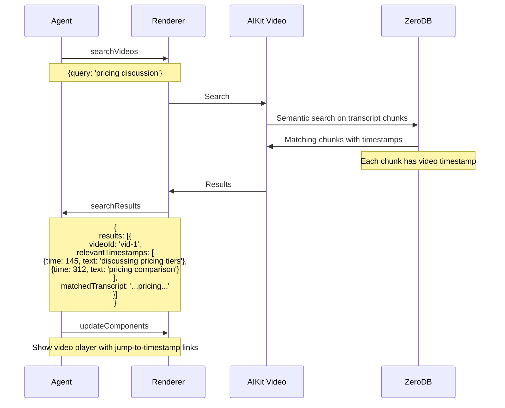
```mermaid
sequenceDiagram
    participant Agent
    participant Renderer
    participant AIKit as AIKit Video
    participant ZeroDB

    Agent->>Renderer: searchVideos
    Note over Agent,Renderer: {query: 'pricing discussion'}

    Renderer->>AIKit: Search

    AIKit->>ZeroDB: Semantic search on transcript chunks

    ZeroDB->>AIKit: Matching chunks with timestamps
    Note over ZeroDB: Each chunk has video timestamp

    AIKit->>Renderer: Results

    Renderer->>Agent: searchResults
    Note over Renderer,Agent: {<br/>  results: [{<br/>    videoId: 'vid-1',<br/>    relevantTimestamps: [<br/>      {time: 145, text: 'discussing pricing tiers'},<br/>      {time: 312, text: 'pricing comparison'}<br/>    ],<br/>    matchedTranscript: '...pricing...'<br/>  }]<br/>}

    Agent->>Renderer: updateComponents
    Note over Agent,Renderer: Show video player with jump-to-timestamp links
```

### Filtered Search Flow

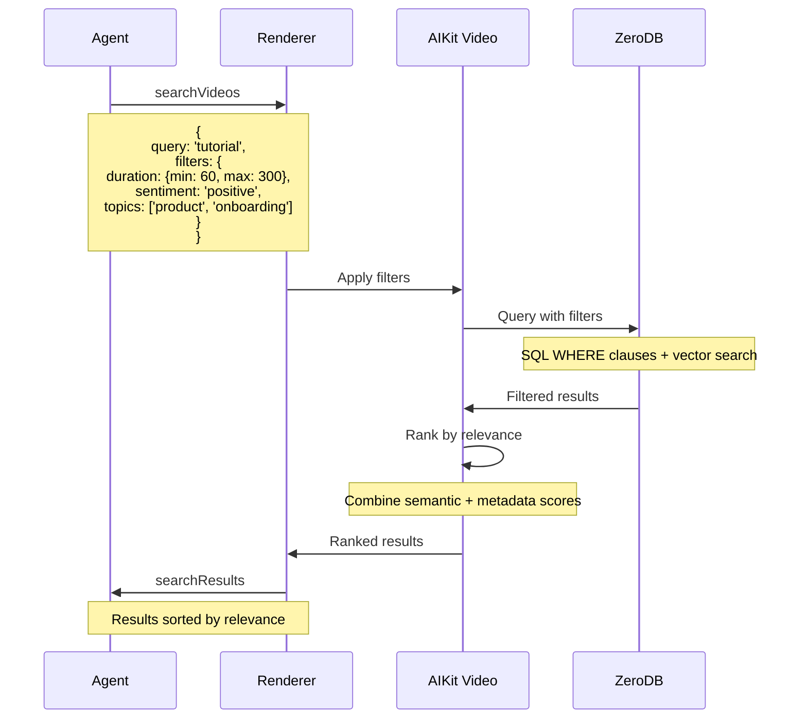
```mermaid
sequenceDiagram
    participant Agent
    participant Renderer
    participant AIKit as AIKit Video
    participant ZeroDB

    Agent->>Renderer: searchVideos
    Note over Agent,Renderer: {<br/>  query: 'tutorial',<br/>  filters: {<br/>    duration: {min: 60, max: 300},<br/>    sentiment: 'positive',<br/>    topics: ['product', 'onboarding']<br/>  }<br/>}

    Renderer->>AIKit: Apply filters

    AIKit->>ZeroDB: Query with filters
    Note over ZeroDB: SQL WHERE clauses + vector search

    ZeroDB->>AIKit: Filtered results

    AIKit->>AIKit: Rank by relevance
    Note over AIKit: Combine semantic + metadata scores

    AIKit->>Renderer: Ranked results

    Renderer->>Agent: searchResults
    Note over Renderer,Agent: Results sorted by relevance
```

## AI Metadata Flow

### On-Demand Metadata Request

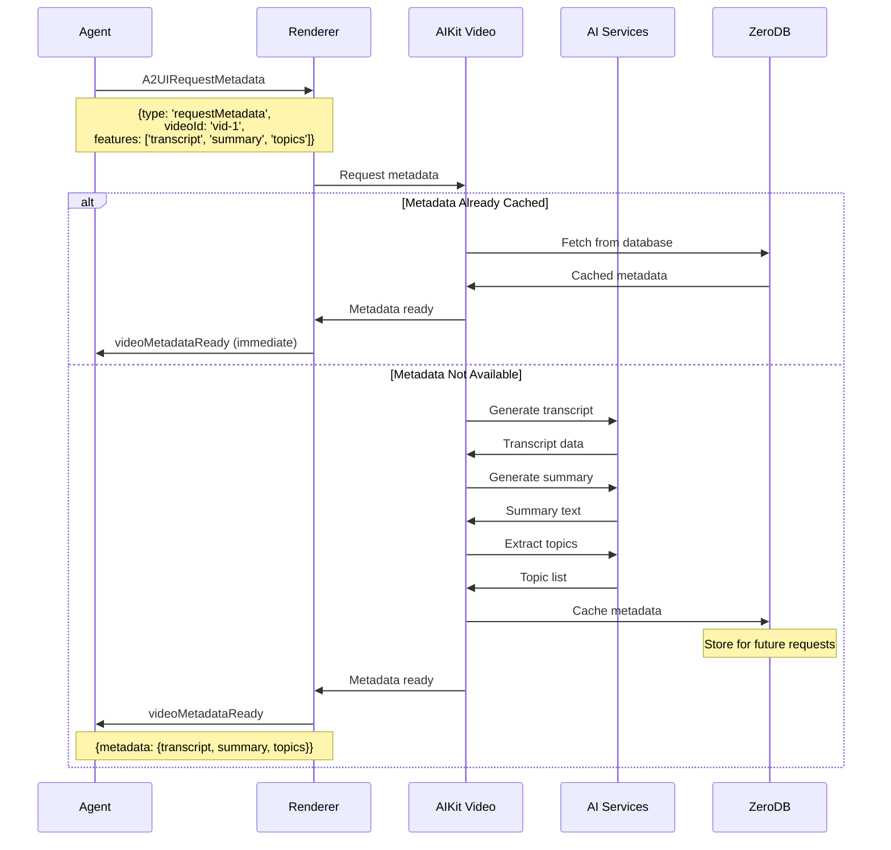
```mermaid
sequenceDiagram
    participant Agent
    participant Renderer
    participant AIKit as AIKit Video
    participant AI as AI Services
    participant ZeroDB

    Agent->>Renderer: A2UIRequestMetadata
    Note over Agent,Renderer: {type: 'requestMetadata',<br/>videoId: 'vid-1',<br/>features: ['transcript', 'summary', 'topics']}

    Renderer->>AIKit: Request metadata

    alt Metadata Already Cached
        AIKit->>ZeroDB: Fetch from database
        ZeroDB->>AIKit: Cached metadata
        AIKit->>Renderer: Metadata ready
        Renderer->>Agent: videoMetadataReady (immediate)

    else Metadata Not Available
        AIKit->>AI: Generate transcript
        AI->>AIKit: Transcript data

        AIKit->>AI: Generate summary
        AI->>AIKit: Summary text

        AIKit->>AI: Extract topics
        AI->>AIKit: Topic list

        AIKit->>ZeroDB: Cache metadata
        Note over ZeroDB: Store for future requests

        AIKit->>Renderer: Metadata ready

        Renderer->>Agent: videoMetadataReady
        Note over Renderer,Agent: {metadata: {transcript, summary, topics}}
    end
```

### Automatic Metadata Generation

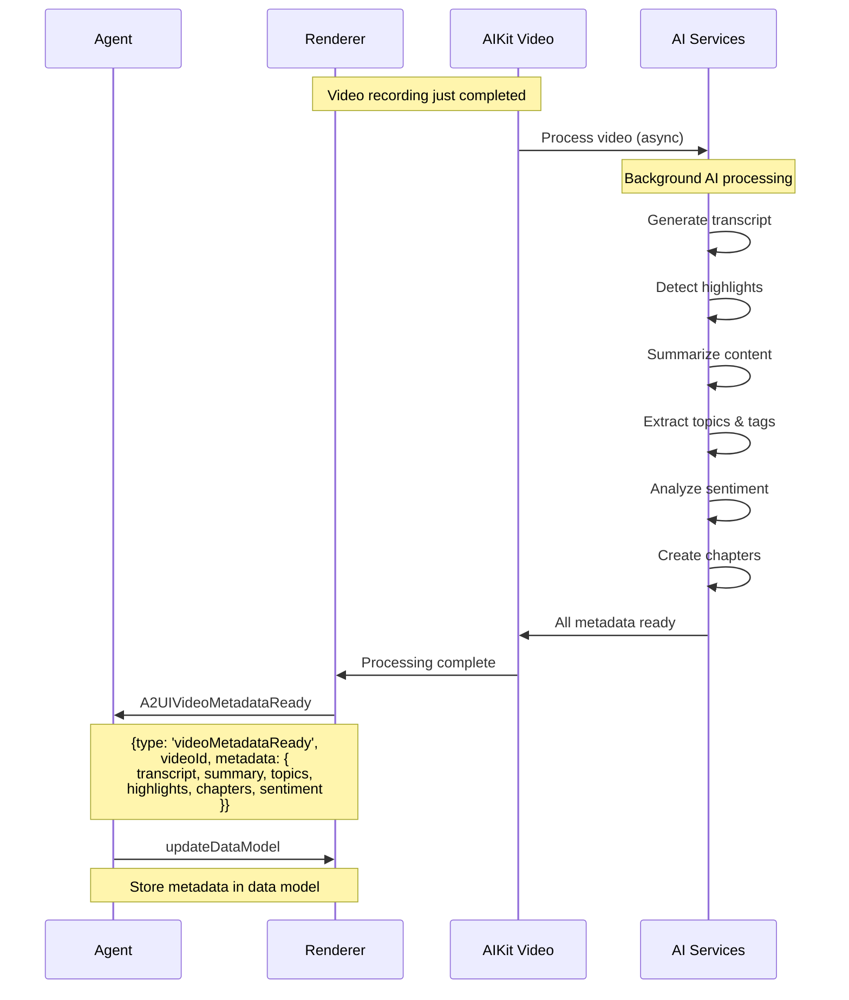
```mermaid
sequenceDiagram
    participant Agent
    participant Renderer
    participant AIKit as AIKit Video
    participant AI as AI Services

    Note over Renderer,AIKit: Video recording just completed

    AIKit->>AI: Process video (async)
    Note over AI: Background AI processing

    AI->>AI: Generate transcript
    AI->>AI: Detect highlights
    AI->>AI: Summarize content
    AI->>AI: Extract topics & tags
    AI->>AI: Analyze sentiment
    AI->>AI: Create chapters

    AI->>AIKit: All metadata ready

    AIKit->>Renderer: Processing complete

    Renderer->>Agent: A2UIVideoMetadataReady
    Note over Renderer,Agent: {type: 'videoMetadataReady',<br/>videoId, metadata: {<br/>  transcript, summary, topics,<br/>  highlights, chapters, sentiment<br/>}}

    Agent->>Renderer: updateDataModel
    Note over Agent,Renderer: Store metadata in data model
```

### Partial Metadata Updates

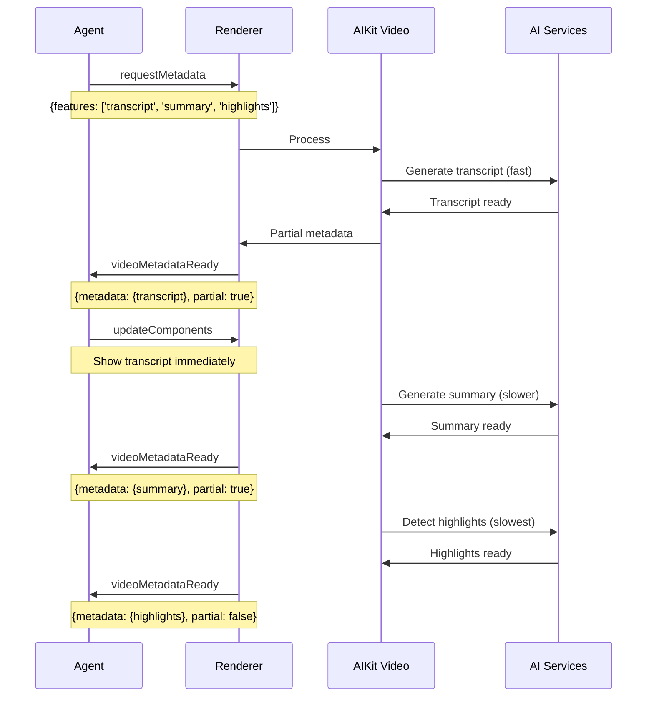
```mermaid
sequenceDiagram
    participant Agent
    participant Renderer
    participant AIKit as AIKit Video
    participant AI as AI Services

    Agent->>Renderer: requestMetadata
    Note over Agent,Renderer: {features: ['transcript', 'summary', 'highlights']}

    Renderer->>AIKit: Process

    AIKit->>AI: Generate transcript (fast)
    AI->>AIKit: Transcript ready

    AIKit->>Renderer: Partial metadata

    Renderer->>Agent: videoMetadataReady
    Note over Renderer,Agent: {metadata: {transcript}, partial: true}

    Agent->>Renderer: updateComponents
    Note over Agent,Renderer: Show transcript immediately

    AIKit->>AI: Generate summary (slower)
    AI->>AIKit: Summary ready

    Renderer->>Agent: videoMetadataReady
    Note over Renderer,Agent: {metadata: {summary}, partial: true}

    AIKit->>AI: Detect highlights (slowest)
    AI->>AIKit: Highlights ready

    Renderer->>Agent: videoMetadataReady
    Note over Renderer,Agent: {metadata: {highlights}, partial: false}
```

## Progress Tracking Flow

### Single-Device Progress Update

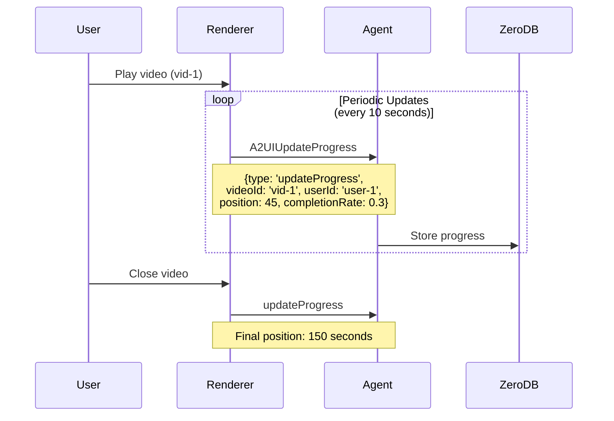
```mermaid
sequenceDiagram
    participant User
    participant Renderer
    participant Agent
    participant ZeroDB

    User->>Renderer: Play video (vid-1)

    loop Periodic Updates (every 10 seconds)
        Renderer->>Agent: A2UIUpdateProgress
        Note over Renderer,Agent: {type: 'updateProgress',<br/>videoId: 'vid-1', userId: 'user-1',<br/>position: 45, completionRate: 0.3}

        Agent->>ZeroDB: Store progress
    end

    User->>Renderer: Close video

    Renderer->>Agent: updateProgress
    Note over Renderer,Agent: Final position: 150 seconds
```

### Cross-Device Progress Sync

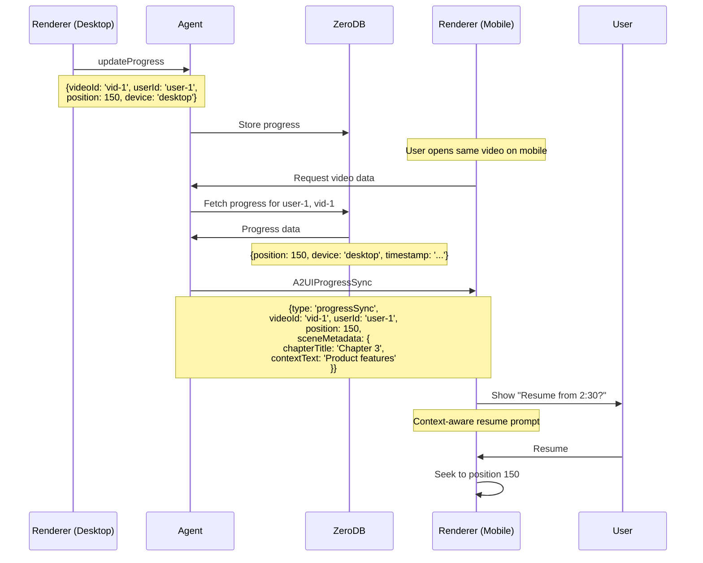
```mermaid
sequenceDiagram
    participant Device1 as Renderer (Desktop)
    participant Agent
    participant ZeroDB
    participant Device2 as Renderer (Mobile)

    Device1->>Agent: updateProgress
    Note over Device1,Agent: {videoId: 'vid-1', userId: 'user-1',<br/>position: 150, device: 'desktop'}

    Agent->>ZeroDB: Store progress

    Note over Device2: User opens same video on mobile

    Device2->>Agent: Request video data

    Agent->>ZeroDB: Fetch progress for user-1, vid-1

    ZeroDB->>Agent: Progress data
    Note over ZeroDB: {position: 150, device: 'desktop', timestamp: '...'}

    Agent->>Device2: A2UIProgressSync
    Note over Agent,Device2: {type: 'progressSync',<br/>videoId: 'vid-1', userId: 'user-1',<br/>position: 150,<br/>sceneMetadata: {<br/>  chapterTitle: 'Chapter 3',<br/>  contextText: 'Product features'<br/>}}

    Device2->>User: Show "Resume from 2:30?"
    Note over Device2: Context-aware resume prompt

    User->>Device2: Resume

    Device2->>Device2: Seek to position 150
```

### Scene-Aware Resume

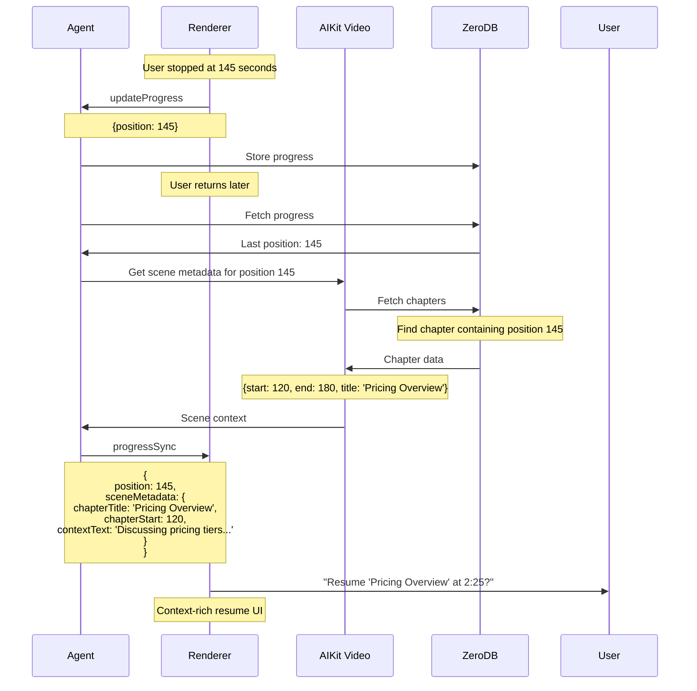
```mermaid
sequenceDiagram
    participant Agent
    participant Renderer
    participant AIKit as AIKit Video
    participant ZeroDB

    Note over Renderer: User stopped at 145 seconds

    Renderer->>Agent: updateProgress
    Note over Renderer,Agent: {position: 145}

    Agent->>ZeroDB: Store progress

    Note over Renderer: User returns later

    Agent->>ZeroDB: Fetch progress

    ZeroDB->>Agent: Last position: 145

    Agent->>AIKit: Get scene metadata for position 145

    AIKit->>ZeroDB: Fetch chapters
    Note over ZeroDB: Find chapter containing position 145

    ZeroDB->>AIKit: Chapter data
    Note over AIKit: {start: 120, end: 180, title: 'Pricing Overview'}

    AIKit->>Agent: Scene context

    Agent->>Renderer: progressSync
    Note over Agent,Renderer: {<br/>  position: 145,<br/>  sceneMetadata: {<br/>    chapterTitle: 'Pricing Overview',<br/>    chapterStart: 120,<br/>    contextText: 'Discussing pricing tiers...'<br/>  }<br/>}

    Renderer->>User: "Resume 'Pricing Overview' at 2:25?"
    Note over Renderer: Context-rich resume UI
```

## Recommendations Flow

### Content-Based Recommendations

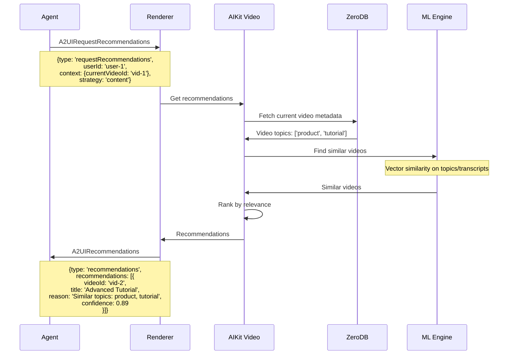
```mermaid
sequenceDiagram
    participant Agent
    participant Renderer
    participant AIKit as AIKit Video
    participant ZeroDB
    participant AI as ML Engine

    Agent->>Renderer: A2UIRequestRecommendations
    Note over Agent,Renderer: {type: 'requestRecommendations',<br/>userId: 'user-1',<br/>context: {currentVideoId: 'vid-1'},<br/>strategy: 'content'}

    Renderer->>AIKit: Get recommendations

    AIKit->>ZeroDB: Fetch current video metadata
    ZeroDB->>AIKit: Video topics: ['product', 'tutorial']

    AIKit->>AI: Find similar videos
    Note over AI: Vector similarity on topics/transcripts

    AI->>AIKit: Similar videos

    AIKit->>AIKit: Rank by relevance

    AIKit->>Renderer: Recommendations

    Renderer->>Agent: A2UIRecommendations
    Note over Renderer,Agent: {type: 'recommendations',<br/>recommendations: [{<br/>  videoId: 'vid-2',<br/>  title: 'Advanced Tutorial',<br/>  reason: 'Similar topics: product, tutorial',<br/>  confidence: 0.89<br/>}]}
```

### Collaborative Filtering Recommendations

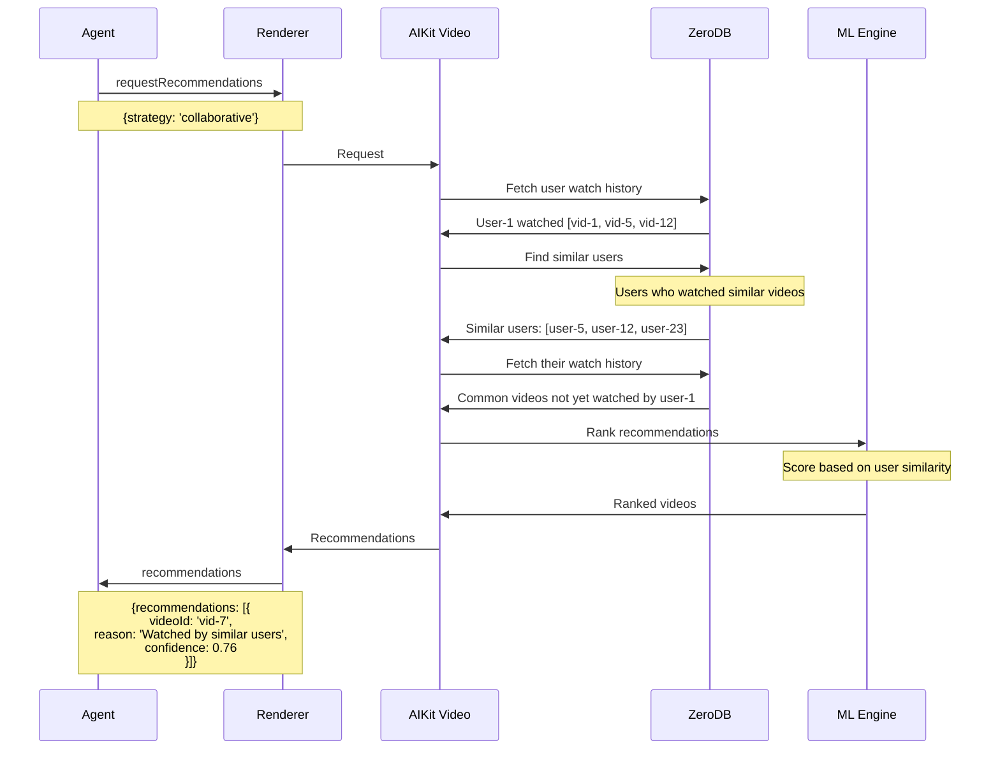
```mermaid
sequenceDiagram
    participant Agent
    participant Renderer
    participant AIKit as AIKit Video
    participant ZeroDB
    participant AI as ML Engine

    Agent->>Renderer: requestRecommendations
    Note over Agent,Renderer: {strategy: 'collaborative'}

    Renderer->>AIKit: Request

    AIKit->>ZeroDB: Fetch user watch history
    ZeroDB->>AIKit: User-1 watched [vid-1, vid-5, vid-12]

    AIKit->>ZeroDB: Find similar users
    Note over ZeroDB: Users who watched similar videos

    ZeroDB->>AIKit: Similar users: [user-5, user-12, user-23]

    AIKit->>ZeroDB: Fetch their watch history
    ZeroDB->>AIKit: Common videos not yet watched by user-1

    AIKit->>AI: Rank recommendations
    Note over AI: Score based on user similarity

    AI->>AIKit: Ranked videos

    AIKit->>Renderer: Recommendations

    Renderer->>Agent: recommendations
    Note over Renderer,Agent: {recommendations: [{<br/>  videoId: 'vid-7',<br/>  reason: 'Watched by similar users',<br/>  confidence: 0.76<br/>}]}
```

### Hybrid Recommendations

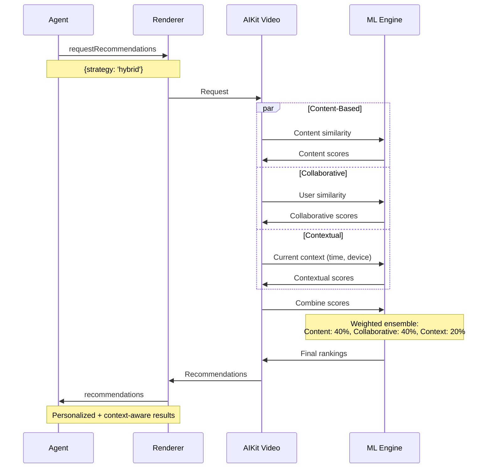
```mermaid
sequenceDiagram
    participant Agent
    participant Renderer
    participant AIKit as AIKit Video
    participant AI as ML Engine

    Agent->>Renderer: requestRecommendations
    Note over Agent,Renderer: {strategy: 'hybrid'}

    Renderer->>AIKit: Request

    par Content-Based
        AIKit->>AI: Content similarity
        AI->>AIKit: Content scores
    and Collaborative
        AIKit->>AI: User similarity
        AI->>AIKit: Collaborative scores
    and Contextual
        AIKit->>AI: Current context (time, device)
        AI->>AIKit: Contextual scores
    end

    AIKit->>AI: Combine scores
    Note over AI: Weighted ensemble:<br/>Content: 40%, Collaborative: 40%, Context: 20%

    AI->>AIKit: Final rankings

    AIKit->>Renderer: Recommendations

    Renderer->>Agent: recommendations
    Note over Renderer,Agent: Personalized + context-aware results
```

### Real-Time Recommendation Updates

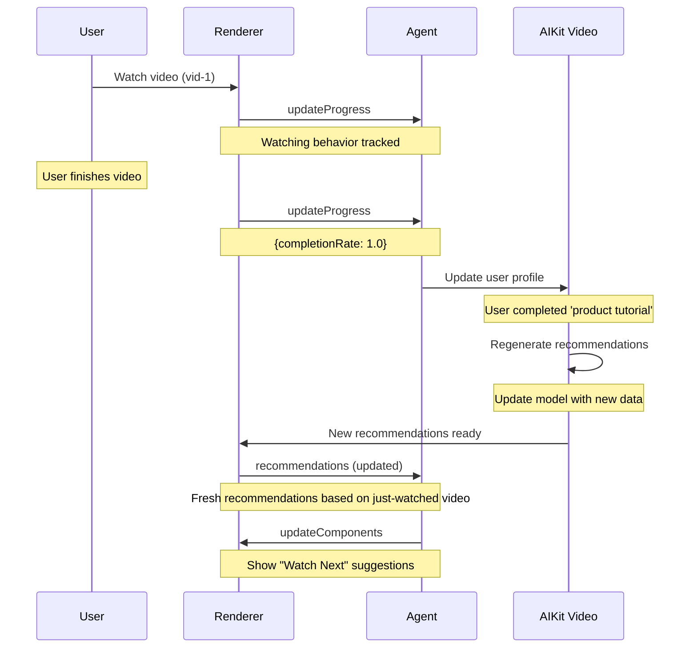
```mermaid
sequenceDiagram
    participant User
    participant Renderer
    participant Agent
    participant AIKit as AIKit Video

    User->>Renderer: Watch video (vid-1)

    Renderer->>Agent: updateProgress
    Note over Renderer,Agent: Watching behavior tracked

    Note over User: User finishes video

    Renderer->>Agent: updateProgress
    Note over Renderer,Agent: {completionRate: 1.0}

    Agent->>AIKit: Update user profile
    Note over AIKit: User completed 'product tutorial'

    AIKit->>AIKit: Regenerate recommendations
    Note over AIKit: Update model with new data

    AIKit->>Renderer: New recommendations ready

    Renderer->>Agent: recommendations (updated)
    Note over Renderer,Agent: Fresh recommendations based on just-watched video

    Agent->>Renderer: updateComponents
    Note over Agent,Renderer: Show "Watch Next" suggestions
```

## Data Model Extensions

### Extended Video State

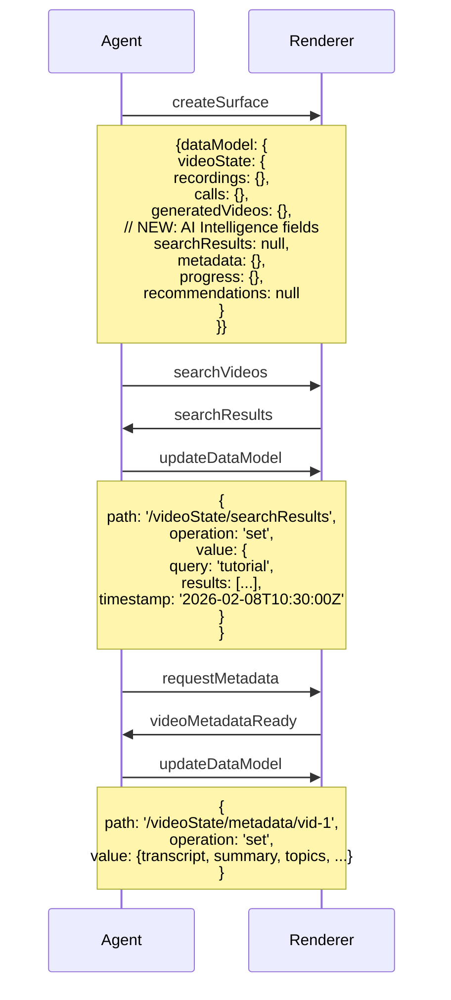
```mermaid
sequenceDiagram
    participant Agent
    participant Renderer

    Agent->>Renderer: createSurface
    Note over Agent,Renderer: {dataModel: {<br/>  videoState: {<br/>    recordings: {},<br/>    calls: {},<br/>    generatedVideos: {},<br/>    // NEW: AI Intelligence fields<br/>    searchResults: null,<br/>    metadata: {},<br/>    progress: {},<br/>    recommendations: null<br/>  }<br/>}}

    Agent->>Renderer: searchVideos

    Renderer->>Agent: searchResults

    Agent->>Renderer: updateDataModel
    Note over Agent,Renderer: {<br/>  path: '/videoState/searchResults',<br/>  operation: 'set',<br/>  value: {<br/>    query: 'tutorial',<br/>    results: [...],<br/>    timestamp: '2026-02-08T10:30:00Z'<br/>  }<br/>}

    Agent->>Renderer: requestMetadata

    Renderer->>Agent: videoMetadataReady

    Agent->>Renderer: updateDataModel
    Note over Agent,Renderer: {<br/>  path: '/videoState/metadata/vid-1',<br/>  operation: 'set',<br/>  value: {transcript, summary, topics, ...}<br/>}
```

## Message Schemas

### A2UISearchVideos

```typescript
interface A2UISearchVideos extends A2UIMessage {
  type: 'searchVideos'
  surfaceId: string
  query: string
  filters?: {
    duration?: {
      min?: number       // Seconds
      max?: number
    }
    dateRange?: {
      after?: string     // ISO 8601
      before?: string
    }
    sentiment?: 'positive' | 'neutral' | 'negative'
    topics?: string[]
    tags?: string[]
  }
  limit?: number         // Max results (default: 10)
  offset?: number        // Pagination offset
}
```

### A2UISearchResults

```typescript
interface A2UISearchResults extends A2UIMessage {
  type: 'searchResults'
  surfaceId: string
  results: Array<{
    videoId: string
    title: string
    thumbnail?: string
    relevantTimestamps: Array<{
      time: number       // Seconds
      text: string       // Transcript excerpt
      confidence: number // 0-1 relevance score
    }>
    matchedTranscript: string  // Full matched excerpt
    confidence: number         // Overall relevance (0-1)
    metadata: {
      duration: number
      topics: string[]
      summary: string
      createdAt: string
    }
  }>
  totalResults: number   // Total matching videos (for pagination)
  query: string          // Original query
}
```

### A2UIRequestMetadata

```typescript
interface A2UIRequestMetadata extends A2UIMessage {
  type: 'requestMetadata'
  surfaceId: string
  videoId: string
  features?: string[]    // ['transcript', 'summary', 'topics', 'highlights', 'chapters']
                         // If omitted, all features generated
}
```

### A2UIVideoMetadataReady

```typescript
interface A2UIVideoMetadataReady extends A2UIMessage {
  type: 'videoMetadataReady'
  surfaceId: string
  videoId: string
  partial?: boolean      // True if more metadata coming
  metadata: {
    transcript?: {
      text: string
      words: Array<{
        text: string
        start: number    // Seconds
        end: number
        confidence?: number
      }>
      speakers?: Array<{
        id: string
        name?: string
        segments: Array<{start: number, end: number}>
      }>
    }
    summary?: string
    topics?: string[]
    tags?: string[]
    sentiment?: {
      overall: 'positive' | 'neutral' | 'negative'
      score: number      // -1 to 1
      timeline: Array<{
        timestamp: number
        sentiment: number
      }>
    }
    highlights?: Array<{
      timestamp: number
      duration: number
      reason: string
      confidence: number
      thumbnailUrl?: string
    }>
    chapters?: Array<{
      start: number
      end: number
      title: string
      summary?: string
    }>
  }
}
```

### A2UIUpdateProgress

```typescript
interface A2UIUpdateProgress extends A2UIMessage {
  type: 'updateProgress'
  surfaceId: string
  videoId: string
  userId: string
  position: number       // Current position in seconds
  completionRate: number // 0-1 (percentage watched)
  device: string         // 'desktop' | 'mobile' | 'tablet'
  timestamp: string      // ISO 8601
}
```

### A2UIProgressSync

```typescript
interface A2UIProgressSync extends A2UIMessage {
  type: 'progressSync'
  surfaceId: string
  videoId: string
  userId: string
  position: number
  lastWatched: string    // ISO 8601
  completionRate: number
  device: string         // Device where last watched
  sceneMetadata?: {
    chapterTitle?: string
    chapterStart?: number
    contextText?: string // Brief description of scene
  }
}
```

### A2UIRequestRecommendations

```typescript
interface A2UIRequestRecommendations extends A2UIMessage {
  type: 'requestRecommendations'
  surfaceId: string
  userId: string
  context?: {
    currentVideoId?: string
    recentTopics?: string[]
    sessionDuration?: number  // Minutes in current session
  }
  strategy?: 'content' | 'collaborative' | 'hybrid'
  limit?: number         // Max recommendations (default: 5)
}
```

### A2UIRecommendations

```typescript
interface A2UIRecommendations extends A2UIMessage {
  type: 'recommendations'
  surfaceId: string
  recommendations: Array<{
    videoId: string
    title: string
    thumbnail: string
    reason: string       // Human-readable explanation
    confidence: number   // 0-1 recommendation strength
    metadata: {
      duration: number
      topics: string[]
      summary: string
      viewCount?: number
      rating?: number
    }
  }>
  strategy: string       // Strategy used
  generatedAt: string    // ISO 8601
}
```

## Implementation Notes

### For Agent Developers

1. **Semantic search**: Use natural language queries, not keyword matching
2. **Metadata caching**: Check if metadata exists before requesting
3. **Progress tracking**: Update every 10-30 seconds during playback
4. **Recommendations**: Request on video end for "watch next" experience
5. **Privacy**: Progress/recommendations are user-specific, handle accordingly
6. **Performance**: AI operations are async, show loading states
7. **Fallbacks**: Provide basic search/recommendations if AI unavailable

### For Renderer Implementers

1. Use AIKit Video's AI+Database features (ZeroDB integration)
2. Cache metadata aggressively (expensive to regenerate)
3. Implement background metadata generation for new videos
4. Use vector embeddings for semantic search (not SQL LIKE)
5. Track progress server-side for cross-device sync
6. Implement recommendation refresh on user behavior changes
7. Handle partial metadata delivery (progressive enhancement)

### Performance Considerations

- **Semantic search**: 100-500ms (vector similarity)
- **Metadata generation**: 10-60 seconds (depends on video length)
- **Progress sync**: Real-time (< 100ms round trip)
- **Recommendations**: 200-1000ms (hybrid strategy slower)
- **Vector embeddings**: Pre-computed during metadata generation
- **Database queries**: Indexed on common filters (duration, topics, etc.)

## Browser Compatibility

All AI Intelligence features are backend-driven, no browser limitations.

## Related Documents

- [Recording Protocol Flow](./recording-protocol-flow.md)
- [Video Call Protocol Flow](./video-call-protocol-flow.md)
- [Video Generation Protocol Flow](./video-generation-protocol-flow.md)
- [Error Handling Flow](./error-handling-flow.md)
- [Video Protocol PRD](../planning/video-protocol-prd.md)
