# Video Protocol Error Handling

**Version**: 0.10.0-alpha
**Last Updated**: 2026-02-08
**Status**: Specification

## Overview

This document specifies comprehensive error handling for the A2UI Video Protocol. It covers error scenarios for recording, video calls, and video generation, with standardized error codes and recovery strategies.

## Error Message Format

All errors follow the standard A2UI error message format:

```typescript
interface ErrorMessage extends A2UIMessage {
  type: 'error'
  code: string              // Standardized error code
  message: string           // Human-readable message
  details?: unknown         // Additional error context
  surfaceId?: string        // Surface where error occurred
  timestamp?: number        // When error occurred
}
```

## Error Categories

Errors are categorized by severity and recoverability:

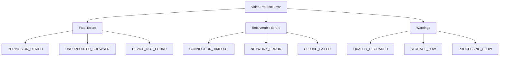
```mermaid
graph TB
    Error[Video Protocol Error]
    Error --> Fatal[Fatal Errors]
    Error --> Recoverable[Recoverable Errors]
    Error --> Warning[Warnings]

    Fatal --> F1[PERMISSION_DENIED]
    Fatal --> F2[UNSUPPORTED_BROWSER]
    Fatal --> F3[DEVICE_NOT_FOUND]

    Recoverable --> R1[CONNECTION_TIMEOUT]
    Recoverable --> R2[NETWORK_ERROR]
    Recoverable --> R3[UPLOAD_FAILED]

    Warning --> W1[QUALITY_DEGRADED]
    Warning --> W2[STORAGE_LOW]
    Warning --> W3[PROCESSING_SLOW]
```

## Recording Errors

### Permission Denied

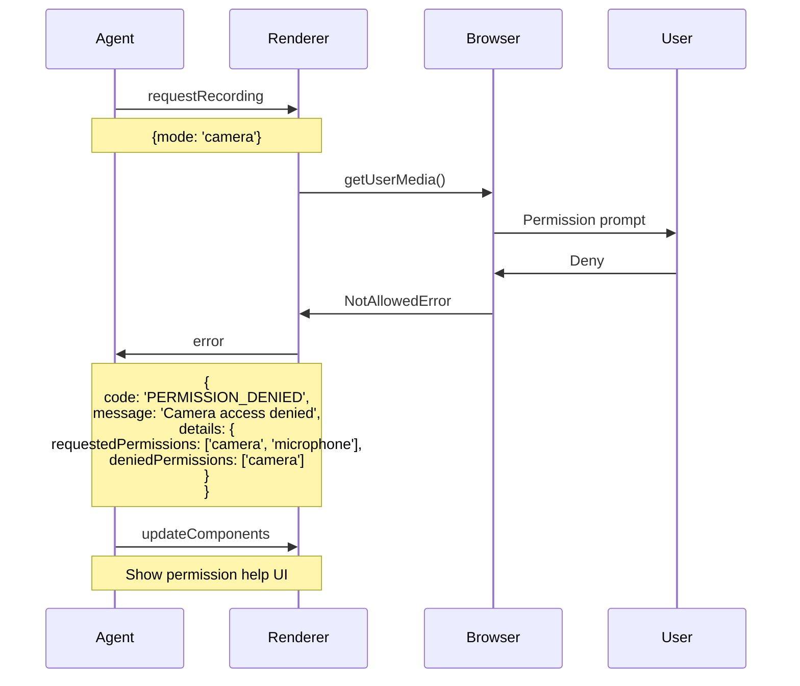
```mermaid
sequenceDiagram
    participant Agent
    participant Renderer
    participant Browser
    participant User

    Agent->>Renderer: requestRecording
    Note over Agent,Renderer: {mode: 'camera'}

    Renderer->>Browser: getUserMedia()

    Browser->>User: Permission prompt

    User->>Browser: Deny

    Browser->>Renderer: NotAllowedError

    Renderer->>Agent: error
    Note over Renderer,Agent: {<br/>  code: 'PERMISSION_DENIED',<br/>  message: 'Camera access denied',<br/>  details: {<br/>    requestedPermissions: ['camera', 'microphone'],<br/>    deniedPermissions: ['camera']<br/>  }<br/>}

    Agent->>Renderer: updateComponents
    Note over Agent,Renderer: Show permission help UI
```

**Error Code**: `PERMISSION_DENIED`

**Details**:
```typescript
{
  requestedPermissions: string[]  // What was requested
  deniedPermissions: string[]     // What was denied
  canPromptAgain: boolean         // If user can be re-prompted
}
```

**Recovery**: Instruct user to grant permissions in browser settings, or retry request.

---

### Device Not Found

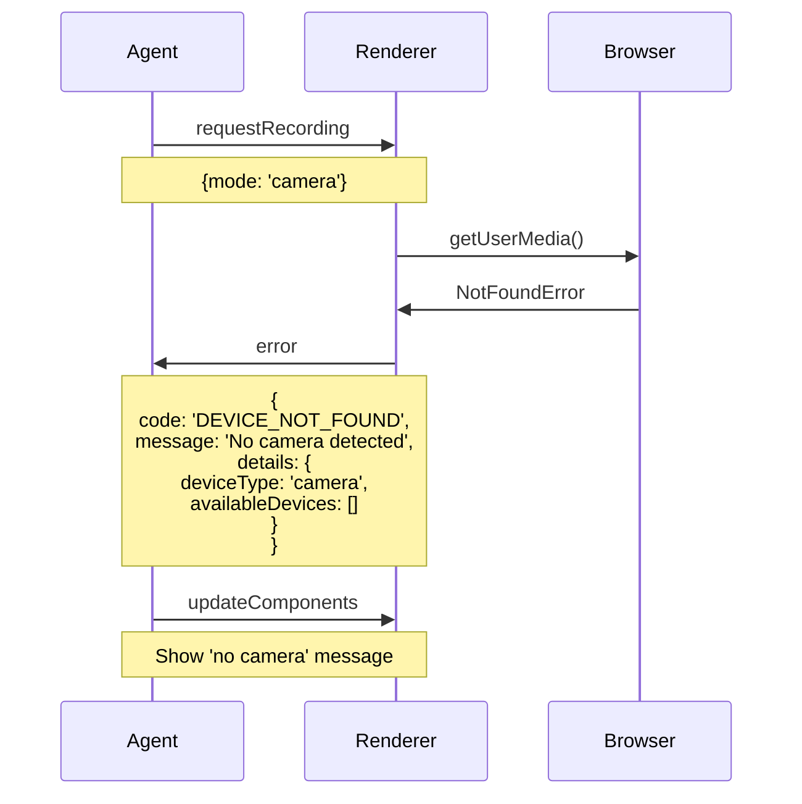
```mermaid
sequenceDiagram
    participant Agent
    participant Renderer
    participant Browser

    Agent->>Renderer: requestRecording
    Note over Agent,Renderer: {mode: 'camera'}

    Renderer->>Browser: getUserMedia()

    Browser->>Renderer: NotFoundError

    Renderer->>Agent: error
    Note over Renderer,Agent: {<br/>  code: 'DEVICE_NOT_FOUND',<br/>  message: 'No camera detected',<br/>  details: {<br/>    deviceType: 'camera',<br/>    availableDevices: []<br/>  }<br/>}

    Agent->>Renderer: updateComponents
    Note over Agent,Renderer: Show 'no camera' message
```

**Error Code**: `DEVICE_NOT_FOUND`

**Details**:
```typescript
{
  deviceType: 'camera' | 'microphone' | 'screen'
  availableDevices: Array<{id: string, label: string}>
}
```

**Recovery**: Prompt user to connect device, or offer alternative recording mode.

---

### Recording Upload Failed

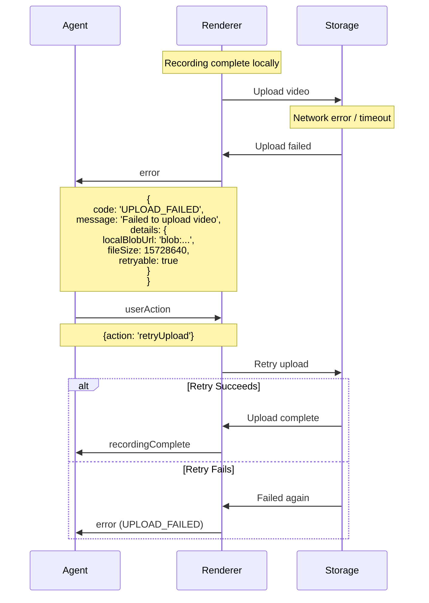
```mermaid
sequenceDiagram
    participant Agent
    participant Renderer
    participant Storage

    Note over Renderer: Recording complete locally

    Renderer->>Storage: Upload video
    Note over Storage: Network error / timeout

    Storage->>Renderer: Upload failed

    Renderer->>Agent: error
    Note over Renderer,Agent: {<br/>  code: 'UPLOAD_FAILED',<br/>  message: 'Failed to upload video',<br/>  details: {<br/>    localBlobUrl: 'blob:...',<br/>    fileSize: 15728640,<br/>    retryable: true<br/>  }<br/>}

    Agent->>Renderer: userAction
    Note over Agent,Renderer: {action: 'retryUpload'}

    Renderer->>Storage: Retry upload

    alt Retry Succeeds
        Storage->>Renderer: Upload complete
        Renderer->>Agent: recordingComplete
    else Retry Fails
        Storage->>Renderer: Failed again
        Renderer->>Agent: error (UPLOAD_FAILED)
    end
```

**Error Code**: `UPLOAD_FAILED`

**Details**:
```typescript
{
  localBlobUrl: string     // Local blob URL for playback
  fileSize: number         // Size in bytes
  retryable: boolean       // Can retry upload
  errorType: 'network' | 'quota' | 'server'
}
```

**Recovery**: Retry upload, allow local playback from blob URL, or save locally.

---

### Recording Timeout

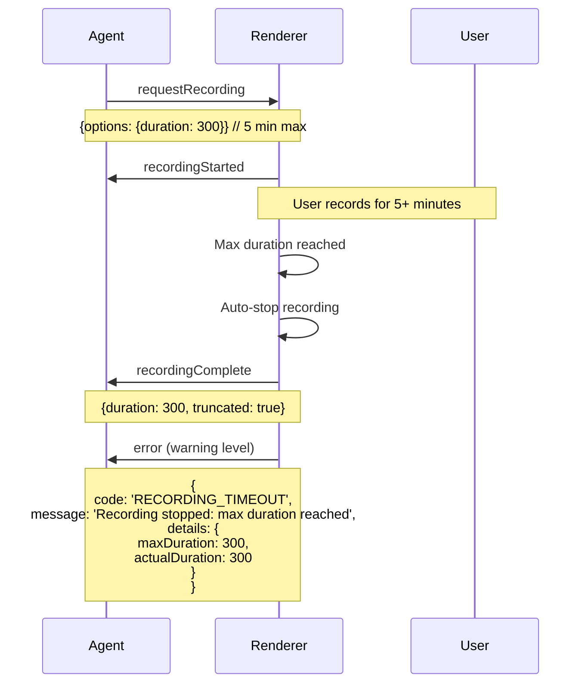
```mermaid
sequenceDiagram
    participant Agent
    participant Renderer
    participant User

    Agent->>Renderer: requestRecording
    Note over Agent,Renderer: {options: {duration: 300}}  // 5 min max

    Renderer->>Agent: recordingStarted

    Note over Renderer,User: User records for 5+ minutes

    Renderer->>Renderer: Max duration reached

    Renderer->>Renderer: Auto-stop recording

    Renderer->>Agent: recordingComplete
    Note over Renderer,Agent: {duration: 300, truncated: true}

    Renderer->>Agent: error (warning level)
    Note over Renderer,Agent: {<br/>  code: 'RECORDING_TIMEOUT',<br/>  message: 'Recording stopped: max duration reached',<br/>  details: {<br/>    maxDuration: 300,<br/>    actualDuration: 300<br/>  }<br/>}
```

**Error Code**: `RECORDING_TIMEOUT`

**Details**:
```typescript
{
  maxDuration: number      // Configured maximum (seconds)
  actualDuration: number   // Actual recorded duration
  truncated: boolean       // Video was auto-stopped
}
```

**Recovery**: Video is saved at maximum duration. Inform user of limit.

## Video Call Errors

### Connection Timeout

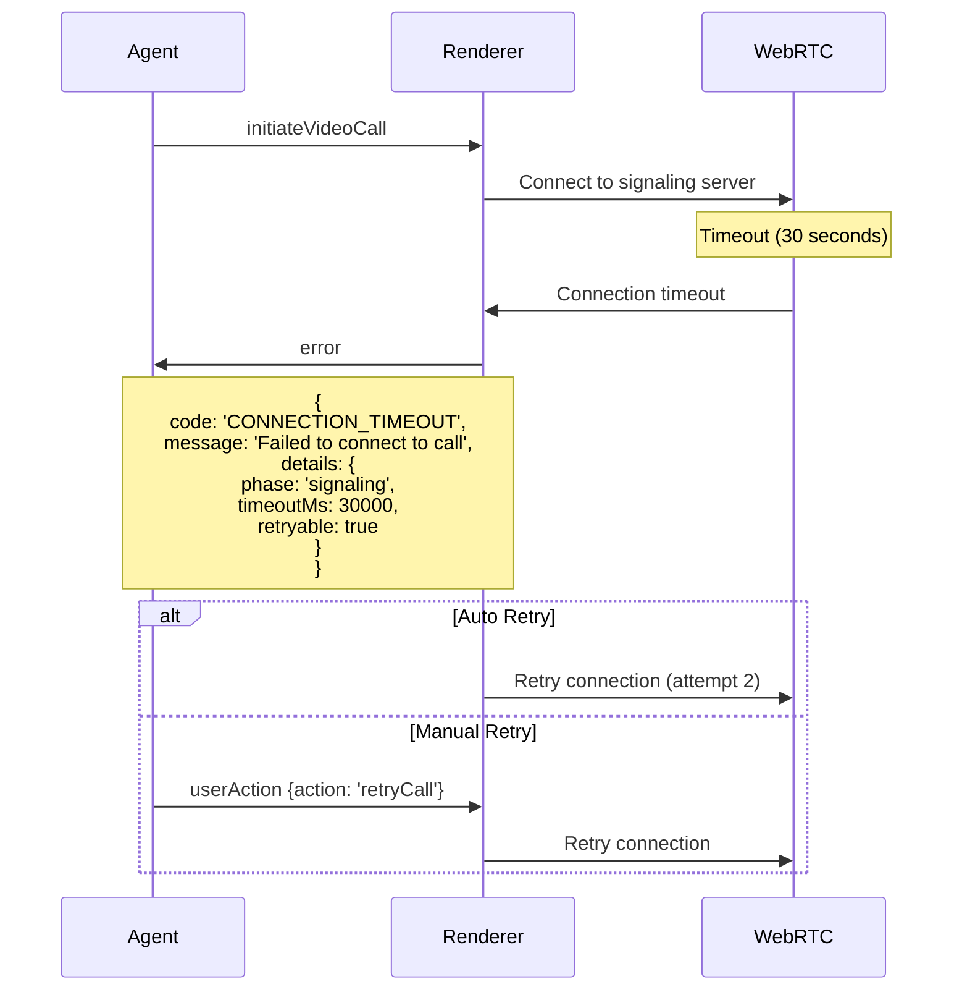
```mermaid
sequenceDiagram
    participant Agent
    participant Renderer
    participant WebRTC

    Agent->>Renderer: initiateVideoCall

    Renderer->>WebRTC: Connect to signaling server
    Note over WebRTC: Timeout (30 seconds)

    WebRTC->>Renderer: Connection timeout

    Renderer->>Agent: error
    Note over Renderer,Agent: {<br/>  code: 'CONNECTION_TIMEOUT',<br/>  message: 'Failed to connect to call',<br/>  details: {<br/>    phase: 'signaling',<br/>    timeoutMs: 30000,<br/>    retryable: true<br/>  }<br/>}

    alt Auto Retry
        Renderer->>WebRTC: Retry connection (attempt 2)
    else Manual Retry
        Agent->>Renderer: userAction {action: 'retryCall'}
        Renderer->>WebRTC: Retry connection
    end
```

**Error Code**: `CONNECTION_TIMEOUT`

**Details**:
```typescript
{
  phase: 'signaling' | 'ice' | 'dtls'
  timeoutMs: number
  retryable: boolean
  attemptNumber?: number
}
```

**Recovery**: Automatic retry with exponential backoff, or manual retry.

---

### Room Full

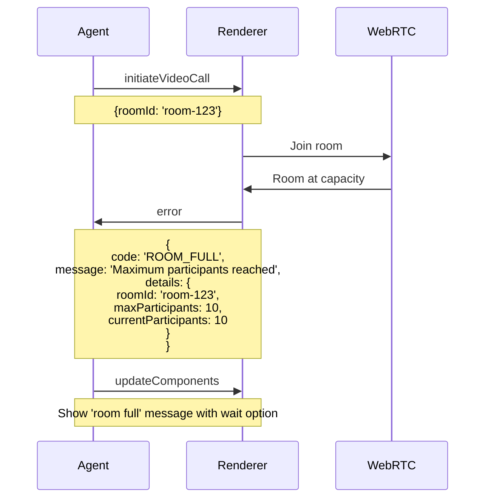
```mermaid
sequenceDiagram
    participant Agent
    participant Renderer
    participant WebRTC

    Agent->>Renderer: initiateVideoCall
    Note over Agent,Renderer: {roomId: 'room-123'}

    Renderer->>WebRTC: Join room

    WebRTC->>Renderer: Room at capacity

    Renderer->>Agent: error
    Note over Renderer,Agent: {<br/>  code: 'ROOM_FULL',<br/>  message: 'Maximum participants reached',<br/>  details: {<br/>    roomId: 'room-123',<br/>    maxParticipants: 10,<br/>    currentParticipants: 10<br/>  }<br/>}

    Agent->>Renderer: updateComponents
    Note over Agent,Renderer: Show 'room full' message with wait option
```

**Error Code**: `ROOM_FULL`

**Details**:
```typescript
{
  roomId: string
  maxParticipants: number
  currentParticipants: number
  canWaitForSlot: boolean
}
```

**Recovery**: Wait for participant to leave, or create new room.

---

### Network Quality Degradation

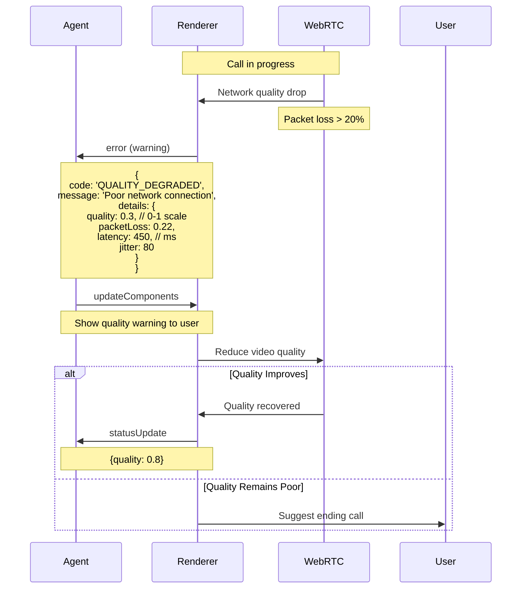
```mermaid
sequenceDiagram
    participant Agent
    participant Renderer
    participant WebRTC
    participant User

    Note over Renderer,WebRTC: Call in progress

    WebRTC->>Renderer: Network quality drop
    Note over WebRTC: Packet loss > 20%

    Renderer->>Agent: error (warning)
    Note over Renderer,Agent: {<br/>  code: 'QUALITY_DEGRADED',<br/>  message: 'Poor network connection',<br/>  details: {<br/>    quality: 0.3,  // 0-1 scale<br/>    packetLoss: 0.22,<br/>    latency: 450,  // ms<br/>    jitter: 80<br/>  }<br/>}

    Agent->>Renderer: updateComponents
    Note over Agent,Renderer: Show quality warning to user

    Renderer->>WebRTC: Reduce video quality

    alt Quality Improves
        WebRTC->>Renderer: Quality recovered
        Renderer->>Agent: statusUpdate
        Note over Renderer,Agent: {quality: 0.8}
    else Quality Remains Poor
        Renderer->>User: Suggest ending call
    end
```

**Error Code**: `QUALITY_DEGRADED`

**Details**:
```typescript
{
  quality: number          // 0-1 overall quality score
  packetLoss: number       // Percentage (0-1)
  latency: number          // Milliseconds
  jitter: number           // Milliseconds
  bandwidth: number        // Kbps
  recommendedAction: 'reduce_quality' | 'audio_only' | 'end_call'
}
```

**Recovery**: Reduce video quality, switch to audio-only, or end call.

---

### Peer Connection Failed

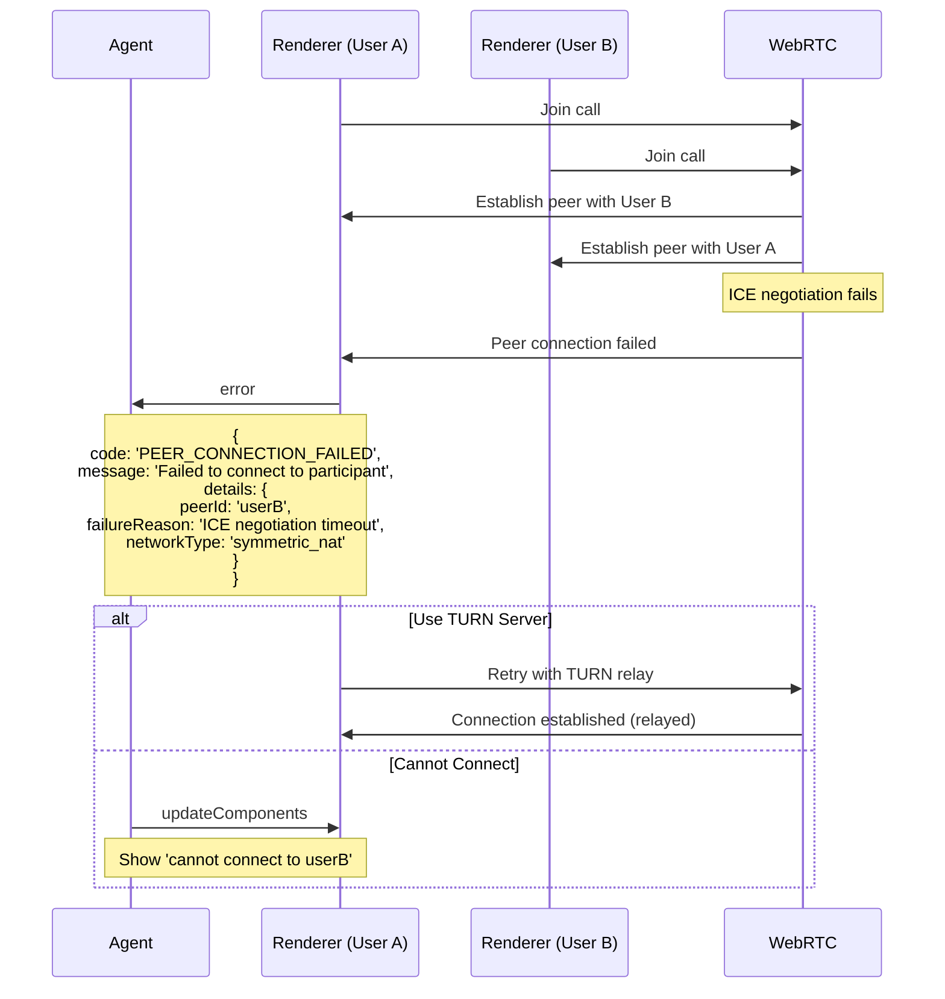
```mermaid
sequenceDiagram
    participant Agent
    participant Renderer1 as Renderer (User A)
    participant Renderer2 as Renderer (User B)
    participant WebRTC

    Renderer1->>WebRTC: Join call
    Renderer2->>WebRTC: Join call

    WebRTC->>Renderer1: Establish peer with User B
    WebRTC->>Renderer2: Establish peer with User A

    Note over WebRTC: ICE negotiation fails

    WebRTC->>Renderer1: Peer connection failed

    Renderer1->>Agent: error
    Note over Renderer1,Agent: {<br/>  code: 'PEER_CONNECTION_FAILED',<br/>  message: 'Failed to connect to participant',<br/>  details: {<br/>    peerId: 'userB',<br/>    failureReason: 'ICE negotiation timeout',<br/>    networkType: 'symmetric_nat'<br/>  }<br/>}

    alt Use TURN Server
        Renderer1->>WebRTC: Retry with TURN relay
        WebRTC->>Renderer1: Connection established (relayed)
    else Cannot Connect
        Agent->>Renderer1: updateComponents
        Note over Agent,Renderer1: Show 'cannot connect to userB'
    end
```

**Error Code**: `PEER_CONNECTION_FAILED`

**Details**:
```typescript
{
  peerId: string
  failureReason: 'ice_failure' | 'dtls_failure' | 'timeout'
  networkType?: 'symmetric_nat' | 'restrictive_firewall'
  canRetryWithTurn: boolean
}
```

**Recovery**: Retry with TURN relay server, or exclude participant.

## Video Generation Errors

### Invalid Template

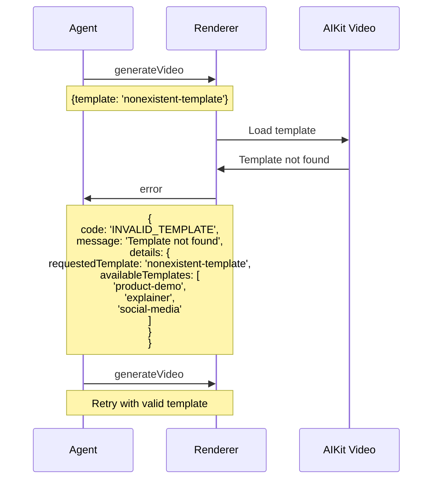
```mermaid
sequenceDiagram
    participant Agent
    participant Renderer
    participant AIKit as AIKit Video

    Agent->>Renderer: generateVideo
    Note over Agent,Renderer: {template: 'nonexistent-template'}

    Renderer->>AIKit: Load template

    AIKit->>Renderer: Template not found

    Renderer->>Agent: error
    Note over Renderer,Agent: {<br/>  code: 'INVALID_TEMPLATE',<br/>  message: 'Template not found',<br/>  details: {<br/>    requestedTemplate: 'nonexistent-template',<br/>    availableTemplates: [<br/>      'product-demo',<br/>      'explainer',<br/>      'social-media'<br/>    ]<br/>  }<br/>}

    Agent->>Renderer: generateVideo
    Note over Agent,Renderer: Retry with valid template
```

**Error Code**: `INVALID_TEMPLATE`

**Details**:
```typescript
{
  requestedTemplate: string
  availableTemplates: string[]
  suggestions?: string[]   // Similar template names
}
```

**Recovery**: Use valid template from list, or fallback to prompt-based generation.

---

### Invalid Data

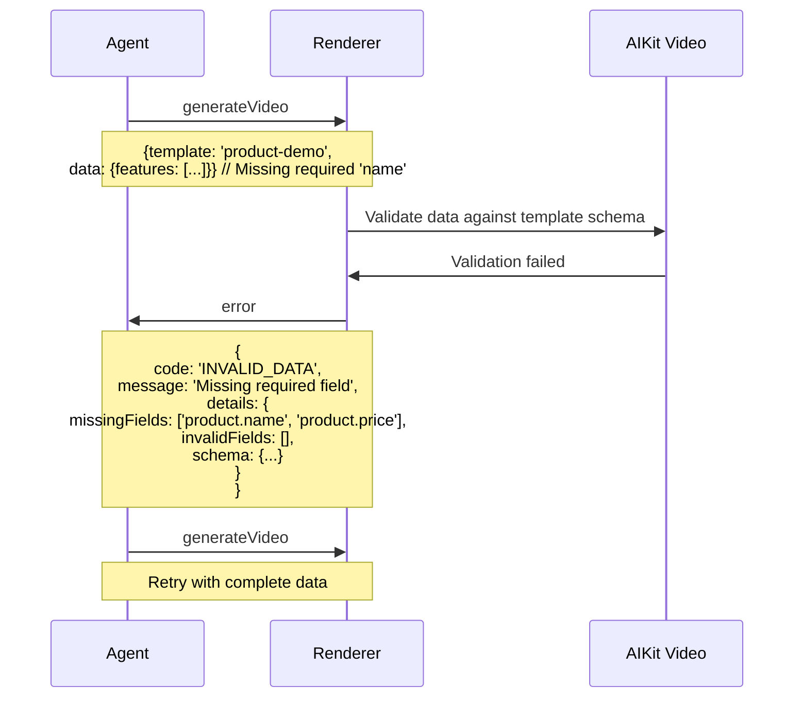
```mermaid
sequenceDiagram
    participant Agent
    participant Renderer
    participant AIKit as AIKit Video

    Agent->>Renderer: generateVideo
    Note over Agent,Renderer: {template: 'product-demo',<br/>data: {features: [...]}}  // Missing required 'name'

    Renderer->>AIKit: Validate data against template schema

    AIKit->>Renderer: Validation failed

    Renderer->>Agent: error
    Note over Renderer,Agent: {<br/>  code: 'INVALID_DATA',<br/>  message: 'Missing required field',<br/>  details: {<br/>    missingFields: ['product.name', 'product.price'],<br/>    invalidFields: [],<br/>    schema: {...}<br/>  }<br/>}

    Agent->>Renderer: generateVideo
    Note over Agent,Renderer: Retry with complete data
```

**Error Code**: `INVALID_DATA`

**Details**:
```typescript
{
  missingFields: string[]   // Required fields not provided
  invalidFields: Array<{
    field: string
    expectedType: string
    actualType: string
  }>
  schema: object           // Template's data schema
}
```

**Recovery**: Provide missing/correct data fields.

---

### Generation Timeout

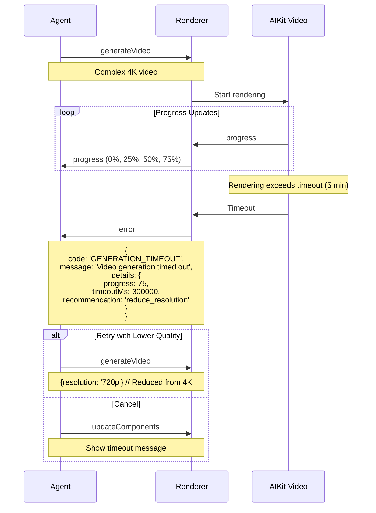
```mermaid
sequenceDiagram
    participant Agent
    participant Renderer
    participant AIKit as AIKit Video

    Agent->>Renderer: generateVideo
    Note over Agent,Renderer: Complex 4K video

    Renderer->>AIKit: Start rendering

    loop Progress Updates
        AIKit->>Renderer: progress
        Renderer->>Agent: progress (0%, 25%, 50%, 75%)
    end

    Note over AIKit: Rendering exceeds timeout (5 min)

    AIKit->>Renderer: Timeout

    Renderer->>Agent: error
    Note over Renderer,Agent: {<br/>  code: 'GENERATION_TIMEOUT',<br/>  message: 'Video generation timed out',<br/>  details: {<br/>    progress: 75,<br/>    timeoutMs: 300000,<br/>    recommendation: 'reduce_resolution'<br/>  }<br/>}

    alt Retry with Lower Quality
        Agent->>Renderer: generateVideo
        Note over Agent,Renderer: {resolution: '720p'}  // Reduced from 4K
    else Cancel
        Agent->>Renderer: updateComponents
        Note over Agent,Renderer: Show timeout message
    end
```

**Error Code**: `GENERATION_TIMEOUT`

**Details**:
```typescript
{
  progress: number         // Last progress before timeout (0-100)
  timeoutMs: number
  recommendation: 'reduce_resolution' | 'simplify_template' | 'retry'
  estimatedTimeNeeded?: number  // Estimated time to complete (ms)
}
```

**Recovery**: Reduce resolution/complexity, or increase timeout limit.

---

### Out of Memory

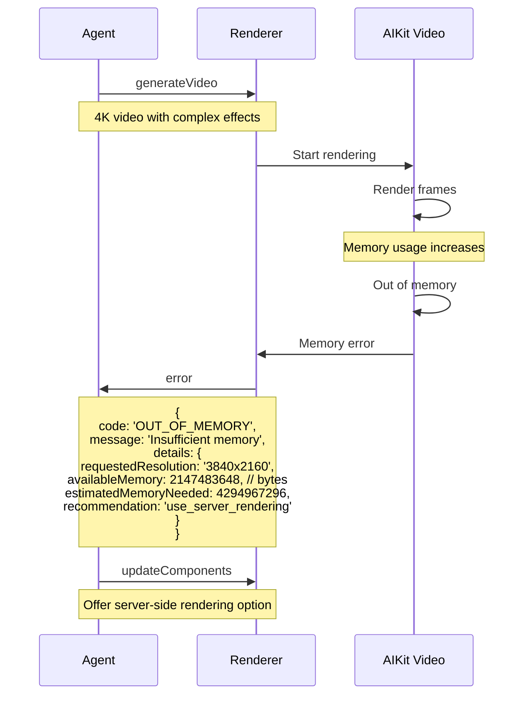
```mermaid
sequenceDiagram
    participant Agent
    participant Renderer
    participant AIKit as AIKit Video

    Agent->>Renderer: generateVideo
    Note over Agent,Renderer: 4K video with complex effects

    Renderer->>AIKit: Start rendering

    AIKit->>AIKit: Render frames
    Note over AIKit: Memory usage increases

    AIKit->>AIKit: Out of memory

    AIKit->>Renderer: Memory error

    Renderer->>Agent: error
    Note over Renderer,Agent: {<br/>  code: 'OUT_OF_MEMORY',<br/>  message: 'Insufficient memory',<br/>  details: {<br/>    requestedResolution: '3840x2160',<br/>    availableMemory: 2147483648,  // bytes<br/>    estimatedMemoryNeeded: 4294967296,<br/>    recommendation: 'use_server_rendering'<br/>  }<br/>}

    Agent->>Renderer: updateComponents
    Note over Agent,Renderer: Offer server-side rendering option
```

**Error Code**: `OUT_OF_MEMORY`

**Details**:
```typescript
{
  requestedResolution: string
  availableMemory: number       // Bytes
  estimatedMemoryNeeded: number // Bytes
  recommendation: 'reduce_resolution' | 'use_server_rendering'
}
```

**Recovery**: Reduce resolution, simplify template, or use server-side rendering.

---

### AI Service Unavailable

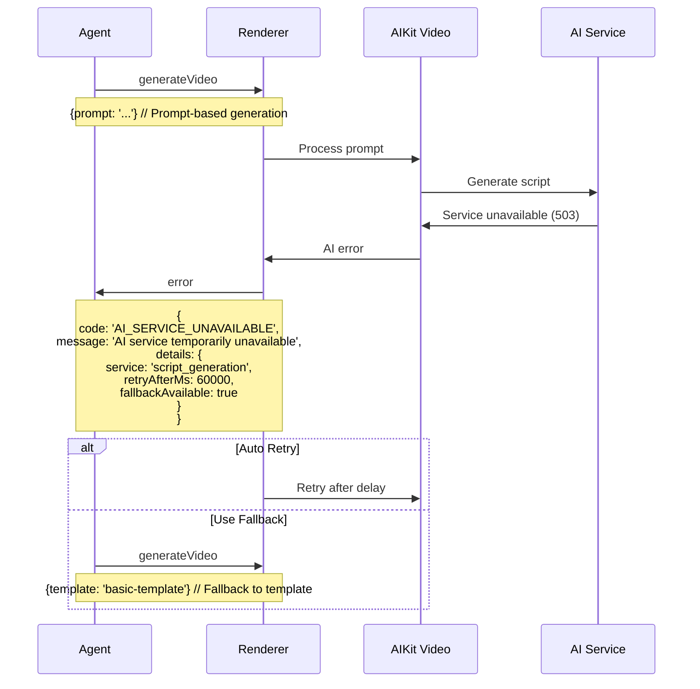
```mermaid
sequenceDiagram
    participant Agent
    participant Renderer
    participant AIKit as AIKit Video
    participant AI as AI Service

    Agent->>Renderer: generateVideo
    Note over Agent,Renderer: {prompt: '...'}  // Prompt-based generation

    Renderer->>AIKit: Process prompt

    AIKit->>AI: Generate script

    AI->>AIKit: Service unavailable (503)

    AIKit->>Renderer: AI error

    Renderer->>Agent: error
    Note over Renderer,Agent: {<br/>  code: 'AI_SERVICE_UNAVAILABLE',<br/>  message: 'AI service temporarily unavailable',<br/>  details: {<br/>    service: 'script_generation',<br/>    retryAfterMs: 60000,<br/>    fallbackAvailable: true<br/>  }<br/>}

    alt Auto Retry
        Renderer->>AIKit: Retry after delay
    else Use Fallback
        Agent->>Renderer: generateVideo
        Note over Agent,Renderer: {template: 'basic-template'}  // Fallback to template
    end
```

**Error Code**: `AI_SERVICE_UNAVAILABLE`

**Details**:
```typescript
{
  service: 'script_generation' | 'voice_synthesis' | 'transcript_generation'
  retryAfterMs?: number
  fallbackAvailable: boolean
  alternativeService?: string
}
```

**Recovery**: Retry after delay, use alternative service, or fallback to template-based generation.

## Error Code Reference

### Fatal Errors (Cannot Recover Without User Action)

| Code | Description | User Action Required |
|------|-------------|---------------------|
| `PERMISSION_DENIED` | User denied browser permissions | Grant permissions in settings |
| `DEVICE_NOT_FOUND` | Camera/microphone not detected | Connect device |
| `UNSUPPORTED_BROWSER` | Browser doesn't support feature | Use modern browser |
| `INVALID_TEMPLATE` | Template does not exist | Choose valid template |
| `INVALID_DATA` | Data schema validation failed | Provide correct data |

### Recoverable Errors (Can Retry)

| Code | Description | Recovery Strategy |
|------|-------------|-------------------|
| `CONNECTION_TIMEOUT` | Network connection timeout | Auto-retry with backoff |
| `UPLOAD_FAILED` | Video upload failed | Retry upload |
| `PEER_CONNECTION_FAILED` | WebRTC peer failed | Use TURN relay |
| `GENERATION_TIMEOUT` | Video rendering timeout | Reduce quality or retry |
| `AI_SERVICE_UNAVAILABLE` | AI service down | Retry or use fallback |

### Warnings (Non-Fatal)

| Code | Description | User Impact |
|------|-------------|-------------|
| `QUALITY_DEGRADED` | Poor network quality | Degraded video/audio |
| `STORAGE_LOW` | Low device storage | May affect recording |
| `PROCESSING_SLOW` | Slow AI processing | Longer wait times |
| `RECORDING_TIMEOUT` | Max duration reached | Recording auto-stopped |

## Error Recovery Patterns

### Exponential Backoff

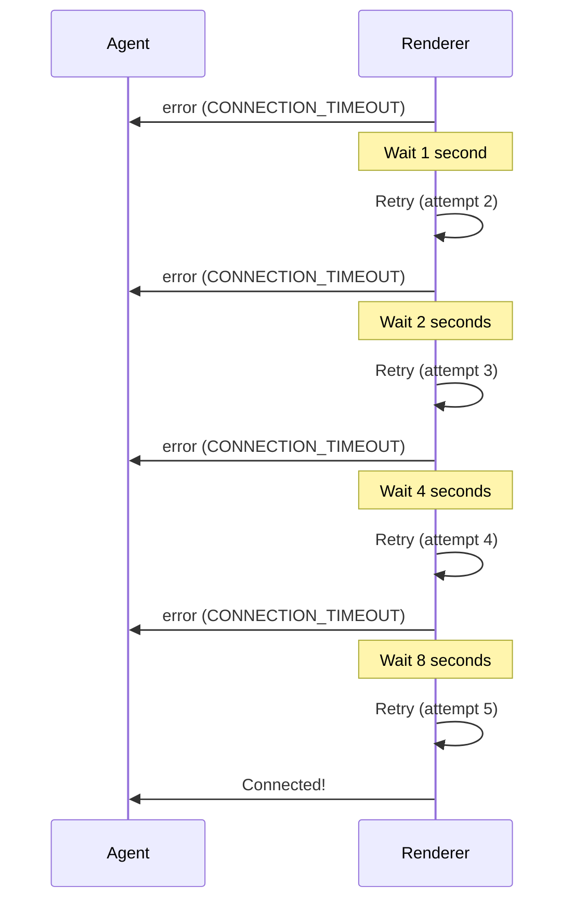
```mermaid
sequenceDiagram
    participant Agent
    participant Renderer

    Renderer->>Agent: error (CONNECTION_TIMEOUT)
    Note over Renderer: Wait 1 second

    Renderer->>Renderer: Retry (attempt 2)
    Renderer->>Agent: error (CONNECTION_TIMEOUT)
    Note over Renderer: Wait 2 seconds

    Renderer->>Renderer: Retry (attempt 3)
    Renderer->>Agent: error (CONNECTION_TIMEOUT)
    Note over Renderer: Wait 4 seconds

    Renderer->>Renderer: Retry (attempt 4)
    Renderer->>Agent: error (CONNECTION_TIMEOUT)
    Note over Renderer: Wait 8 seconds

    Renderer->>Renderer: Retry (attempt 5)
    Renderer->>Agent: Connected!
```

### Circuit Breaker

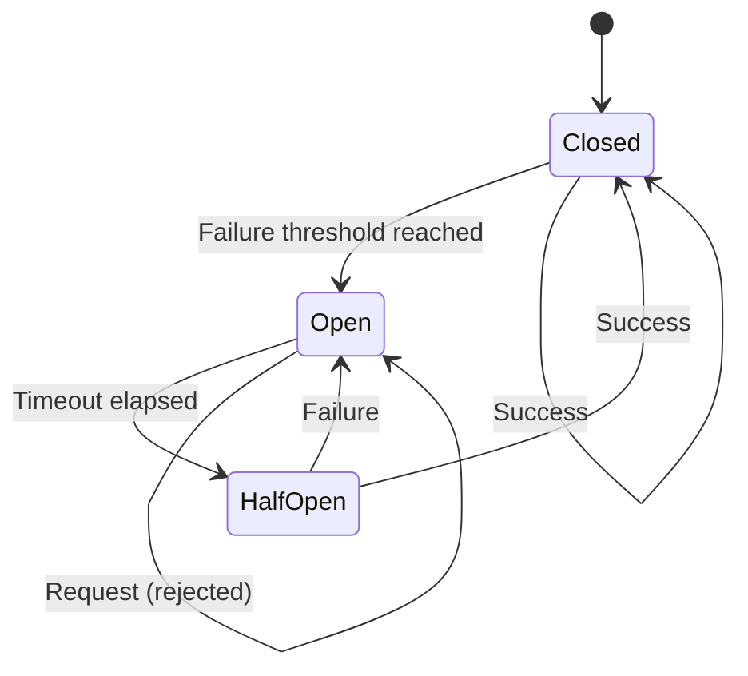
```mermaid
stateDiagram-v2
    [*] --> Closed
    Closed --> Open: Failure threshold reached
    Open --> HalfOpen: Timeout elapsed
    HalfOpen --> Closed: Success
    HalfOpen --> Open: Failure
    Closed --> Closed: Success
    Open --> Open: Request (rejected)
```

### Graceful Degradation

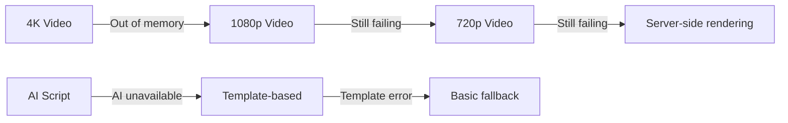
```mermaid
graph LR
    A[4K Video] -->|Out of memory| B[1080p Video]
    B -->|Still failing| C[720p Video]
    C -->|Still failing| D[Server-side rendering]

    E[AI Script] -->|AI unavailable| F[Template-based]
    F -->|Template error| G[Basic fallback]
```

## Implementation Guidelines

### For Agent Developers

1. **Always handle errors**: Every video operation can fail
2. **Provide user feedback**: Show clear error messages
3. **Implement retry logic**: Auto-retry transient failures
4. **Offer alternatives**: Fallback options when primary fails
5. **Log errors**: Track error patterns for debugging
6. **Update UI state**: Reflect error state in data model

Example error handling:

```typescript
transport.on('error', (error) => {
  console.error('Video error:', error)

  switch (error.code) {
    case 'PERMISSION_DENIED':
      // Show permission help UI
      transport.send({
        type: 'updateComponents',
        surfaceId,
        updates: [{
          id: 'error-message',
          operation: 'add',
          component: {
            type: 'text',
            properties: {
              text: 'Please grant camera permissions',
              variant: 'error'
            }
          }
        }]
      })
      break

    case 'CONNECTION_TIMEOUT':
      // Auto-retry
      if (error.details.attemptNumber < 3) {
        setTimeout(() => retryConnection(), 1000 * Math.pow(2, error.details.attemptNumber))
      }
      break

    // ... handle other errors
  }
})
```

### For Renderer Implementers

1. **Provide detailed errors**: Include all relevant context
2. **Use standard error codes**: Follow this specification
3. **Implement timeouts**: Prevent infinite waits
4. **Monitor performance**: Detect degradation early
5. **Validate inputs**: Catch errors before processing
6. **Clean up resources**: Release on errors (streams, connections)

Example error emission:

```typescript
// Good: Detailed error with context
this.emit('error', {
  type: 'error',
  code: 'UPLOAD_FAILED',
  message: 'Failed to upload video to CDN',
  details: {
    localBlobUrl: blobUrl,
    fileSize: file.size,
    retryable: true,
    errorType: 'network',
    httpStatus: 503
  },
  surfaceId,
  timestamp: Date.now()
})

// Bad: Generic error
this.emit('error', {
  type: 'error',
  code: 'ERROR',
  message: 'Something went wrong'
})
```

## Related Documents

- [Recording Protocol Flow](./recording-protocol-flow.md)
- [Video Call Protocol Flow](./video-call-protocol-flow.md)
- [Video Generation Protocol Flow](./video-generation-protocol-flow.md)
- [Video Protocol PRD](../planning/video-protocol-prd.md)
