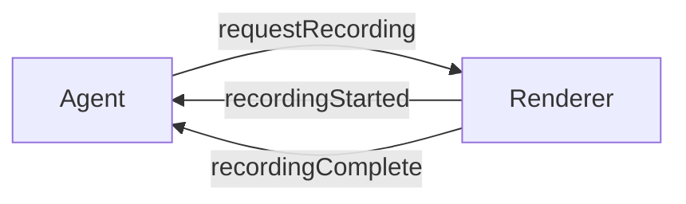
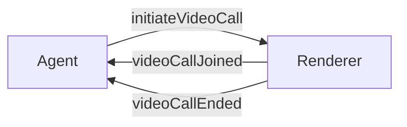
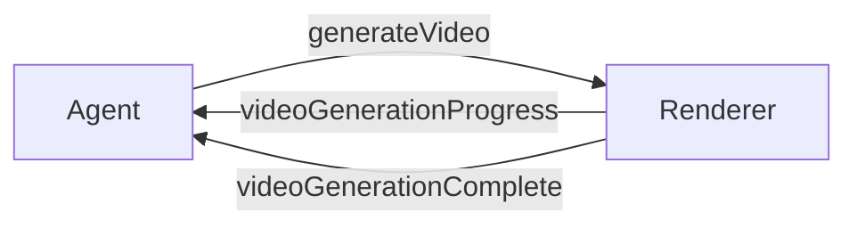
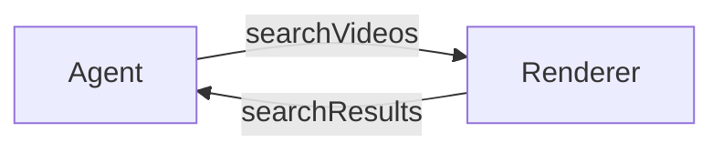
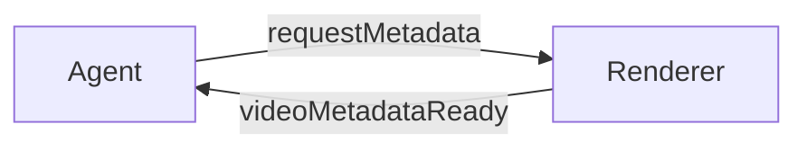
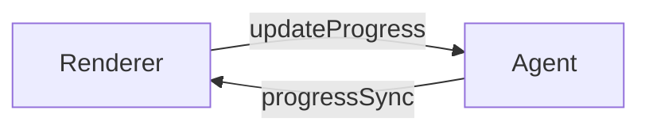
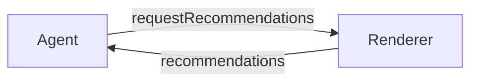
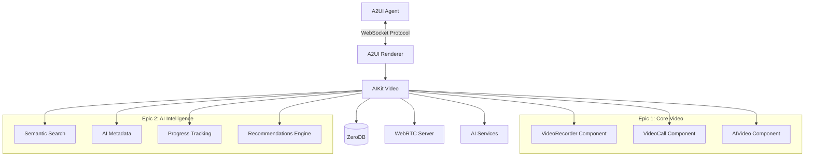
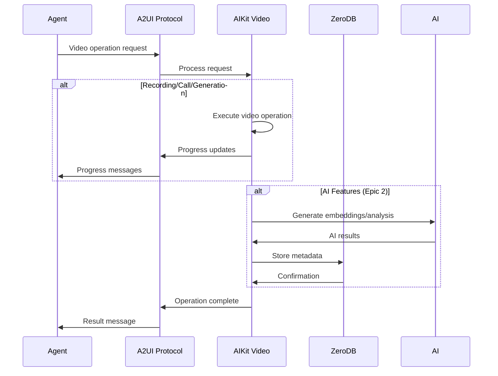

# A2UI Video Protocol Flows

**Version**: 0.10.0-alpha (Epic 1) / 0.11.0-alpha (Epic 2)
**Last Updated**: 2026-02-08
**Status**: Specification

## Overview

This directory contains comprehensive sequence diagrams and flow documentation for the A2UI Video Protocol extension. These documents specify the WebSocket message flows for all video operations in the A2UI ecosystem.

## Protocol Flow Documents

### Epic 1: Core Video Protocol (v0.10)

| Document | Description | Message Types |
|----------|-------------|---------------|
| **[Recording Protocol Flow](./recording-protocol-flow.md)** | Screen/camera recording flows | `requestRecording`<br/>`recordingStarted`<br/>`recordingComplete` |
| **[Video Call Protocol Flow](./video-call-protocol-flow.md)** | Real-time video conferencing | `initiateVideoCall`<br/>`videoCallJoined`<br/>`videoCallEnded` |
| **[Video Generation Protocol Flow](./video-generation-protocol-flow.md)** | AI video generation | `generateVideo`<br/>`videoGenerationProgress`<br/>`videoGenerationComplete` |
| **[Error Handling Flow](./error-handling-flow.md)** | Comprehensive error scenarios | All error codes and recovery patterns |

### Epic 2: AI Intelligence Protocol (v0.11)

| Document | Description | Message Types |
|----------|-------------|---------------|
| **[AI Intelligence Protocol Flow](./ai-intelligence-protocol-flow.md)** | Semantic search, metadata, progress, recommendations | `searchVideos`<br/>`searchResults`<br/>`requestMetadata`<br/>`videoMetadataReady`<br/>`updateProgress`<br/>`progressSync`<br/>`requestRecommendations`<br/>`recommendations` |

## Quick Reference

### Recording Flow



**Use Cases**:
- Screen recording for demos
- Camera recording for testimonials
- Picture-in-Picture (PiP) mode

**Key Features**:
- AI transcription
- Highlight detection
- Automatic summarization

**Document**: [Recording Protocol Flow](./recording-protocol-flow.md)

---

### Video Call Flow



**Use Cases**:
- 1-on-1 video calls
- Multi-participant conferencing
- Screen sharing during calls

**Key Features**:
- Live transcription
- Live captions
- Noise cancellation
- Call recording

**Document**: [Video Call Protocol Flow](./video-call-protocol-flow.md)

---

### Video Generation Flow



**Use Cases**:
- Template-based video creation
- Prompt-based AI generation
- Data-driven video composition

**Key Features**:
- Real-time progress updates
- Streaming preview frames
- Voice synthesis integration

**Document**: [Video Generation Protocol Flow](./video-generation-protocol-flow.md)

---

### Semantic Search Flow



**Use Cases**:
- Find videos by natural language query
- Timestamp-aware content search
- Filtered search (duration, sentiment, topics)

**Key Features**:
- Vector similarity search
- Relevant timestamp extraction
- Confidence scoring

**Document**: [AI Intelligence Protocol Flow](./ai-intelligence-protocol-flow.md#semantic-video-search-flow)

---

### AI Metadata Flow



**Use Cases**:
- Get transcript for video
- Extract summary and topics
- Identify highlights and chapters

**Key Features**:
- Automatic background processing
- On-demand metadata generation
- Partial metadata delivery

**Document**: [AI Intelligence Protocol Flow](./ai-intelligence-protocol-flow.md#ai-metadata-flow)

---

### Progress Tracking Flow



**Use Cases**:
- Track video watch progress
- Cross-device resume
- Scene-aware playback

**Key Features**:
- Real-time progress updates
- Cross-device synchronization
- Context-rich resume prompts

**Document**: [AI Intelligence Protocol Flow](./ai-intelligence-protocol-flow.md#progress-tracking-flow)

---

### Recommendations Flow



**Use Cases**:
- "Watch next" suggestions
- Personalized video discovery
- Context-aware recommendations

**Key Features**:
- Content-based filtering
- Collaborative filtering
- Hybrid recommendation strategies

**Document**: [AI Intelligence Protocol Flow](./ai-intelligence-protocol-flow.md#recommendations-flow)

---

## Message Type Reference

### Epic 1: Core Video Protocol

| Message Type | Direction | Purpose |
|--------------|-----------|---------|
| `requestRecording` | Agent → Renderer | Initiate screen/camera recording |
| `recordingStarted` | Renderer → Agent | Confirm recording began |
| `recordingComplete` | Renderer → Agent | Deliver finished recording |
| `initiateVideoCall` | Agent → Renderer | Start video call session |
| `videoCallJoined` | Renderer → Agent | Participant joined call |
| `videoCallEnded` | Renderer → Agent | Call ended with summary |
| `generateVideo` | Agent → Renderer | Request AI video generation |
| `videoGenerationProgress` | Renderer → Agent | Progress update (0-100%) |
| `videoGenerationComplete` | Renderer → Agent | Video generation finished |

### Epic 2: AI Intelligence Protocol

| Message Type | Direction | Purpose |
|--------------|-----------|---------|
| `searchVideos` | Agent → Renderer | Semantic video search |
| `searchResults` | Renderer → Agent | Search results with relevance |
| `requestMetadata` | Agent → Renderer | Request AI analysis |
| `videoMetadataReady` | Renderer → Agent | AI metadata delivered |
| `updateProgress` | Renderer → Agent | Report playback progress |
| `progressSync` | Agent → Renderer | Sync progress across devices |
| `requestRecommendations` | Agent → Renderer | Request video suggestions |
| `recommendations` | Renderer → Agent | Personalized recommendations |

## Error Codes Reference

### Fatal Errors

| Code | Description | Recovery |
|------|-------------|----------|
| `PERMISSION_DENIED` | User denied permissions | Grant in browser settings |
| `DEVICE_NOT_FOUND` | Camera/mic not detected | Connect device |
| `UNSUPPORTED_BROWSER` | Browser lacks feature support | Use modern browser |
| `INVALID_TEMPLATE` | Template does not exist | Use valid template |
| `INVALID_DATA` | Data validation failed | Provide correct data |

### Recoverable Errors

| Code | Description | Recovery |
|------|-------------|----------|
| `CONNECTION_TIMEOUT` | Network timeout | Auto-retry with backoff |
| `UPLOAD_FAILED` | Upload error | Retry upload |
| `PEER_CONNECTION_FAILED` | WebRTC peer failed | Use TURN relay |
| `GENERATION_TIMEOUT` | Rendering timeout | Reduce quality/retry |
| `AI_SERVICE_UNAVAILABLE` | AI service down | Retry or use fallback |
| `ROOM_FULL` | Max participants reached | Wait or create new room |

### Warnings

| Code | Description | Impact |
|------|-------------|--------|
| `QUALITY_DEGRADED` | Poor network quality | Reduced video quality |
| `STORAGE_LOW` | Low device storage | May affect recording |
| `PROCESSING_SLOW` | Slow AI processing | Longer wait times |
| `RECORDING_TIMEOUT` | Max duration reached | Auto-stopped recording |

**Full Error Documentation**: [Error Handling Flow](./error-handling-flow.md)

## Architecture Overview

### System Components



### Data Flow



## Implementation Roadmap

### Phase 1: Core Video Protocol (Weeks 1-8)

**Status**: Specification complete

**Stories**:
- A2UI-1 through A2UI-3: Video component types
- A2UI-4 through A2UI-6: WebSocket message types
- A2UI-7: Message handlers
- A2UI-8: Protocol flow diagrams ✅

**Dependencies**:
- AIKit Video Epic 13 (AIKIT-72 through AIKIT-125)

### Phase 2: AI Intelligence Protocol (Weeks 9-12)

**Status**: Future specification

**Stories**:
- A2UI-19 through A2UI-20: Semantic search
- A2UI-21 through A2UI-22: AI metadata
- A2UI-23 through A2UI-24: Progress tracking
- A2UI-25 through A2UI-26: Recommendations

**Dependencies**:
- AIKit Video Epic 14 (AIKIT-126 through AIKIT-142)
- ZeroDB integration complete

## Usage Examples

### Recording Example

```typescript
// Agent initiates recording
transport.send({
  type: 'requestRecording',
  surfaceId: 'surface-1',
  recordingId: 'rec-1',
  mode: 'screen',
  options: {
    audio: true,
    quality: 'high',
    ai: {
      transcribe: true,
      highlights: true,
      summary: true
    }
  }
})

// Handle recording completion
transport.on('recordingComplete', ({ videoUrl, transcript, highlights }) => {
  console.log('Recording ready:', videoUrl)
  console.log('Transcript:', transcript)
  console.log('Highlights:', highlights)
})
```

### Video Call Example

```typescript
// Agent initiates call
transport.send({
  type: 'initiateVideoCall',
  surfaceId: 'surface-1',
  callId: 'call-1',
  roomId: 'room-123',
  layout: 'grid',
  ai: {
    liveTranscription: true,
    liveCaptions: true,
    noiseCancellation: true
  }
})

// Handle participants joining
transport.on('videoCallJoined', ({ participantId, displayName }) => {
  console.log(`${displayName} joined the call`)
})

// Handle call end
transport.on('videoCallEnded', ({ duration, summary, actionItems }) => {
  console.log(`Call lasted ${duration} seconds`)
  console.log('Summary:', summary)
  console.log('Action items:', actionItems)
})
```

### Video Generation Example

```typescript
// Agent requests generation
transport.send({
  type: 'generateVideo',
  surfaceId: 'surface-1',
  videoId: 'vid-1',
  template: 'product-demo',
  data: {
    product: {
      name: 'AI Assistant',
      features: ['Smart', 'Fast', 'Accurate']
    }
  },
  streaming: true
})

// Handle progress
transport.on('videoGenerationProgress', ({ progress, frame }) => {
  console.log(`Generation ${progress}% complete`)
  if (frame) {
    // Show preview frame
    updatePreviewImage(frame)
  }
})

// Handle completion
transport.on('videoGenerationComplete', ({ videoUrl, composition }) => {
  console.log('Video ready:', videoUrl)
})
```

### Semantic Search Example

```typescript
// Agent searches videos
transport.send({
  type: 'searchVideos',
  surfaceId: 'surface-1',
  query: 'product tutorial videos',
  filters: {
    duration: { max: 300 },
    topics: ['product', 'tutorial']
  },
  limit: 10
})

// Handle results
transport.on('searchResults', ({ results, totalResults }) => {
  results.forEach(result => {
    console.log(result.title, 'Relevance:', result.confidence)
    console.log('Jump to:', result.relevantTimestamps)
  })
})
```

### AI Metadata Example

```typescript
// Agent requests metadata
transport.send({
  type: 'requestMetadata',
  surfaceId: 'surface-1',
  videoId: 'vid-1',
  features: ['transcript', 'summary', 'topics', 'highlights']
})

// Handle metadata
transport.on('videoMetadataReady', ({ metadata, partial }) => {
  if (metadata.transcript) {
    console.log('Transcript:', metadata.transcript.text)
  }
  if (metadata.summary) {
    console.log('Summary:', metadata.summary)
  }
  if (metadata.highlights) {
    console.log('Highlights:', metadata.highlights)
  }

  if (!partial) {
    console.log('All metadata ready')
  }
})
```

## Testing Strategy

### Protocol Compliance Tests

Each protocol flow includes compliance tests to verify:

1. **Message format validation**: All required fields present
2. **Type safety**: TypeScript types enforced
3. **Sequence correctness**: Messages in proper order
4. **Error handling**: Proper error codes and recovery
5. **Timing constraints**: Timeouts and retries work correctly

### Integration Tests

End-to-end tests with AIKit Video:

1. **Recording flow**: Full recording lifecycle
2. **Call flow**: Multi-participant calls
3. **Generation flow**: Template and prompt-based generation
4. **Search flow**: Semantic search with real data
5. **Metadata flow**: AI processing pipeline
6. **Progress flow**: Cross-device sync
7. **Recommendations flow**: Personalized suggestions

## Browser Compatibility

| Feature | Chrome | Firefox | Safari | Edge |
|---------|--------|---------|--------|------|
| Recording (screen) | ✅ | ✅ | ✅ 13+ | ✅ |
| Recording (camera) | ✅ | ✅ | ✅ | ✅ |
| Video calls | ✅ | ✅ | ✅ | ✅ |
| Video generation | ✅ | ✅ | ✅ | ✅ |
| AI features | ✅ | ✅ | ✅ | ✅ |

Note: AI features are backend-driven, no browser limitations.

## Related Documents

### Core Documentation
- [Product Requirements Document](../planning/video-protocol-prd.md)
- [Product Backlog](../planning/BACKLOG.md)
- [API Documentation](./API.md)

### Protocol Specifications
- [A2UI v0.9 Protocol Types](../../src/types/protocol.ts)
- [Component Types](../../src/types/components.ts)
- [WebSocket Transport](../../src/transport/transport.ts)

### Integration Guides
- AIKit Video Integration (future)
- ZeroDB Integration (future)
- Framework Examples (React, Vue, Svelte) (future)

## Contributing

When adding new protocol flows:

1. Create detailed sequence diagrams using Mermaid
2. Document all message types with TypeScript interfaces
3. Include error scenarios and recovery patterns
4. Provide implementation notes for both agent and renderer developers
5. Add browser compatibility information
6. Include usage examples

## License

MIT License - See [LICENSE](../../LICENSE)

---

**Version**: 0.10.0-alpha (Epic 1) / 0.11.0-alpha (Epic 2)
**Last Updated**: 2026-02-08
**Maintainer**: AINative Studio
