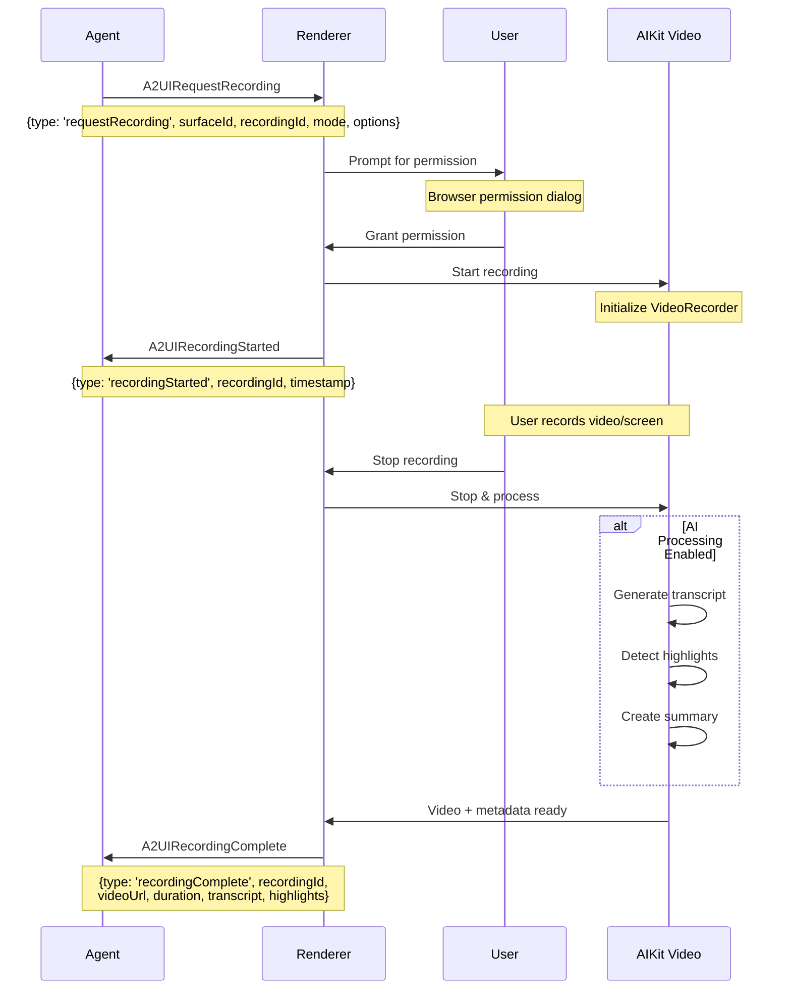
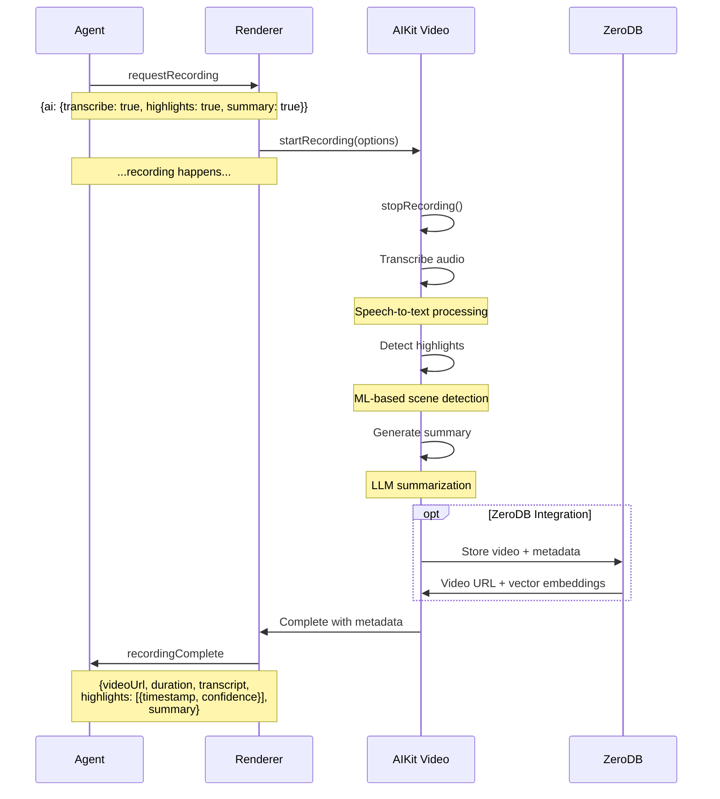
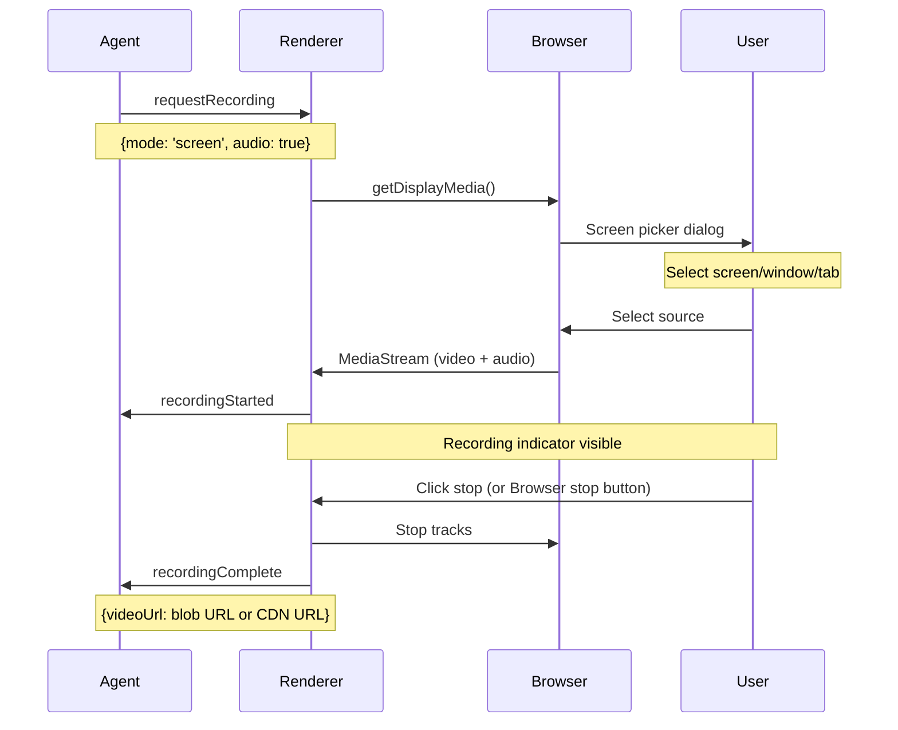
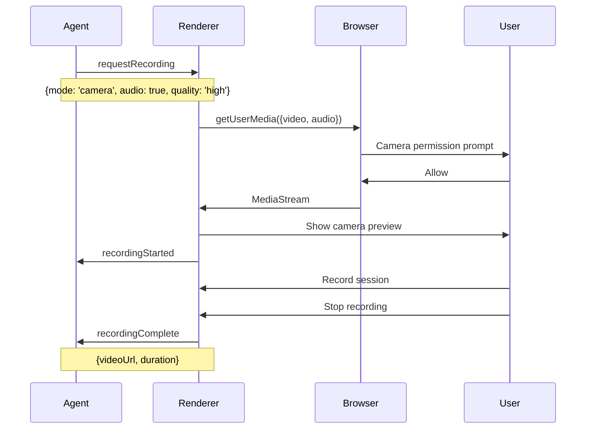
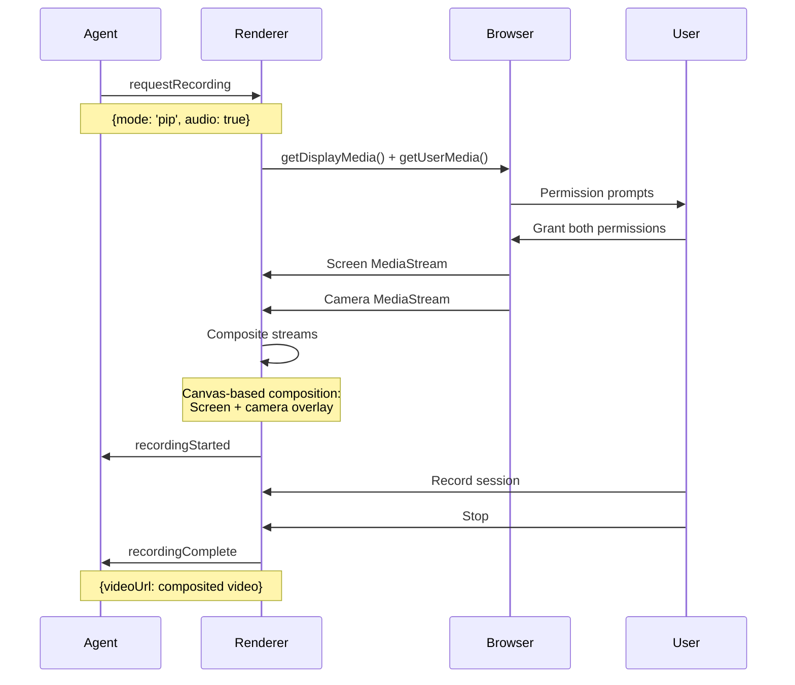
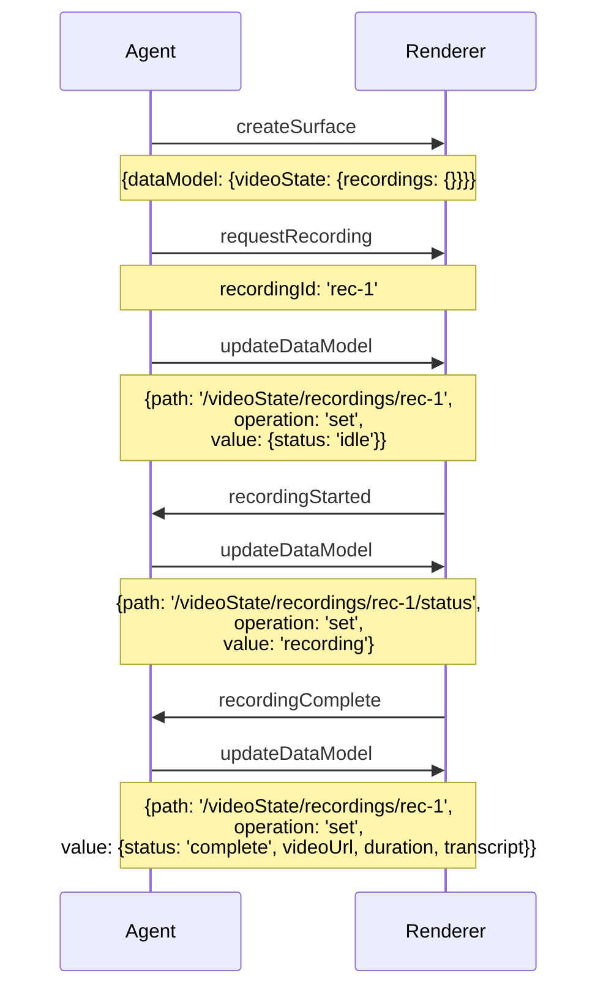
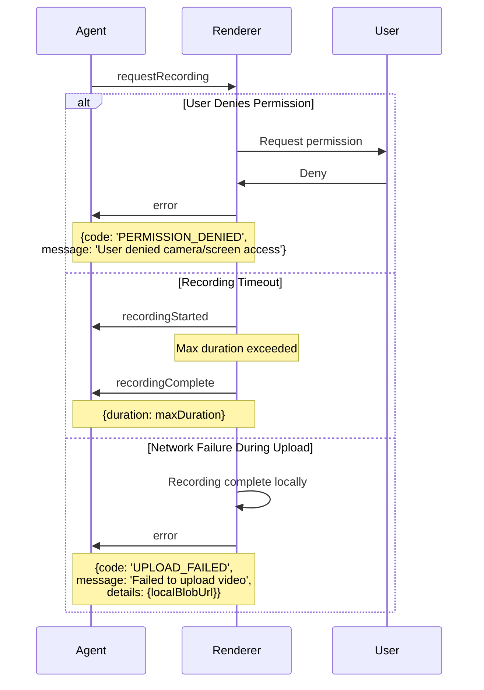

# Video Recording Protocol Flow

**Version**: 0.10.0-alpha
**Last Updated**: 2026-02-08
**Status**: Specification

## Overview

This document specifies the WebSocket message flow for the A2UI Video Recording protocol. The recording flow enables agents to request screen/camera recordings from renderers and receive the resulting video with AI-generated metadata.

## Message Types

The recording flow uses three primary message types:

1. **A2UIRequestRecording** (Agent → Renderer) - Initiates recording
2. **A2UIRecordingStarted** (Renderer → Agent) - Confirms recording began
3. **A2UIRecordingComplete** (Renderer → Agent) - Delivers finished video with metadata

## Basic Recording Flow



## Recording with AI Features

When AI features are enabled in the recording request, AIKit Video performs post-processing:



## Screen Recording Flow



## Camera Recording Flow



## Picture-in-Picture (PiP) Recording Flow



## Data Model Updates

The agent can track recording state via the data model:



## Message Schemas

### A2UIRequestRecording

```typescript
interface A2UIRequestRecording extends A2UIMessage {
  type: 'requestRecording'
  surfaceId: string
  recordingId: string
  mode: 'screen' | 'camera' | 'pip'
  options?: {
    audio?: boolean          // Include audio track (default: true)
    quality?: string         // 'low' | 'medium' | 'high'
    duration?: number        // Max duration in seconds (optional)
    ai?: {
      transcribe?: boolean   // Generate transcript
      highlights?: boolean   // Detect highlights
      summary?: boolean      // Generate summary
      zerodb?: boolean       // Auto-store in ZeroDB
    }
  }
}
```

### A2UIRecordingStarted

```typescript
interface A2UIRecordingStarted extends A2UIMessage {
  type: 'recordingStarted'
  surfaceId: string
  recordingId: string
  timestamp: string         // ISO 8601 timestamp
  metadata?: {
    deviceId?: string       // Camera/mic device ID
    resolution?: string     // e.g., '1920x1080'
  }
}
```

### A2UIRecordingComplete

```typescript
interface A2UIRecordingComplete extends A2UIMessage {
  type: 'recordingComplete'
  surfaceId: string
  recordingId: string
  videoUrl: string          // Blob URL or CDN URL
  duration: number          // Duration in seconds
  metadata?: {
    resolution?: string
    fps?: number
    codec?: string
    fileSize?: number       // Bytes
  }
  // AI-generated fields (if AI enabled)
  transcript?: string
  highlights?: Array<{
    timestamp: number       // Seconds into video
    confidence: number      // 0-1
    reason?: string
  }>
  summary?: string
  topics?: string[]
  tags?: string[]
}
```

## Error Handling

See [error-handling-flow.md](./error-handling-flow.md) for comprehensive error scenarios.

Quick examples:



## Implementation Notes

### For Agent Developers

1. Always generate unique `recordingId` values (UUID recommended)
2. Handle both synchronous errors (permissions) and asynchronous completion
3. Update data model state to reflect recording progress in UI
4. Consider maximum duration limits for recordings
5. AI features require additional processing time - inform users

### For Renderer Implementers

1. Use AIKit Video's `VideoRecorder` component for implementation
2. Request browser permissions before sending `recordingStarted`
3. Handle permission denials gracefully with error messages
4. Stream upload large videos to avoid memory issues
5. Support blob URLs for immediate playback, CDN URLs for persistence
6. Implement quality settings (resolution, bitrate, codec)

### Performance Considerations

- **Screen recording**: High CPU usage, 720p-1080p recommended
- **Camera recording**: Lower overhead, up to 4K possible
- **PiP recording**: Highest CPU usage (compositing), limit to 1080p
- **AI processing**: Adds 10-60 seconds depending on video length
- **Upload**: Large files may take minutes on slow connections

## Browser Compatibility

| Feature | Chrome | Firefox | Safari | Edge |
|---------|--------|---------|--------|------|
| Screen recording | ✅ | ✅ | ✅ 13+ | ✅ |
| Camera recording | ✅ | ✅ | ✅ | ✅ |
| Audio capture | ✅ | ✅ | ✅ | ✅ |
| PiP mode | ✅ | ⚠️ Manual | ⚠️ Manual | ✅ |

## Related Documents

- [Video Call Protocol Flow](./video-call-protocol-flow.md)
- [Video Generation Protocol Flow](./video-generation-protocol-flow.md)
- [Error Handling Flow](./error-handling-flow.md)
- [Video Protocol PRD](../planning/video-protocol-prd.md)
