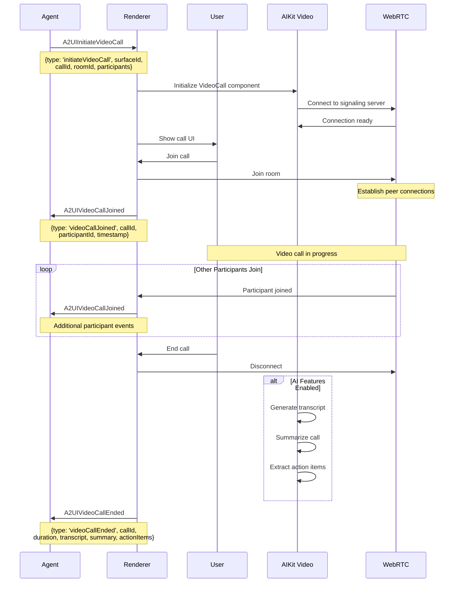
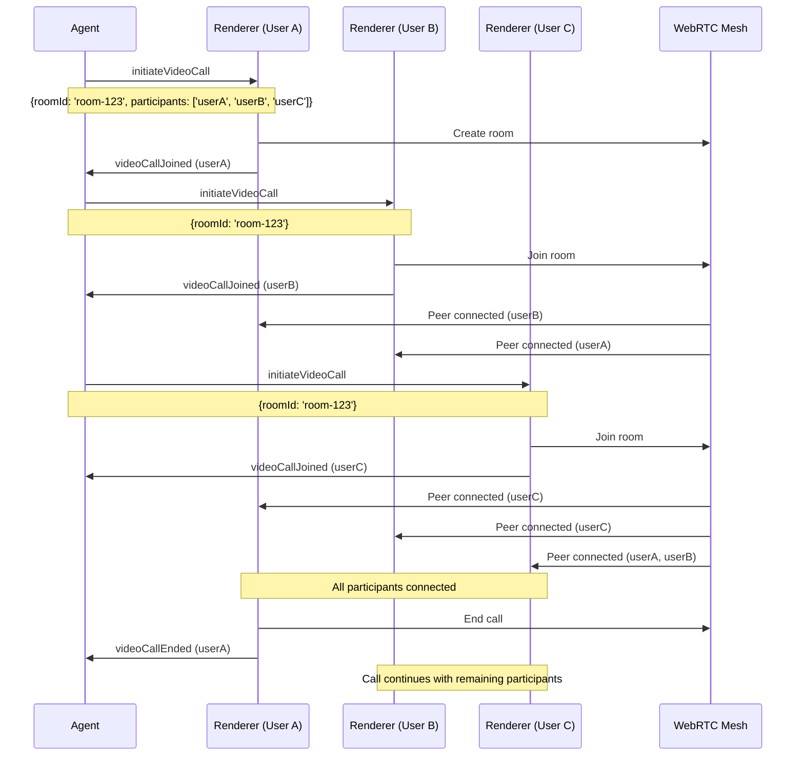
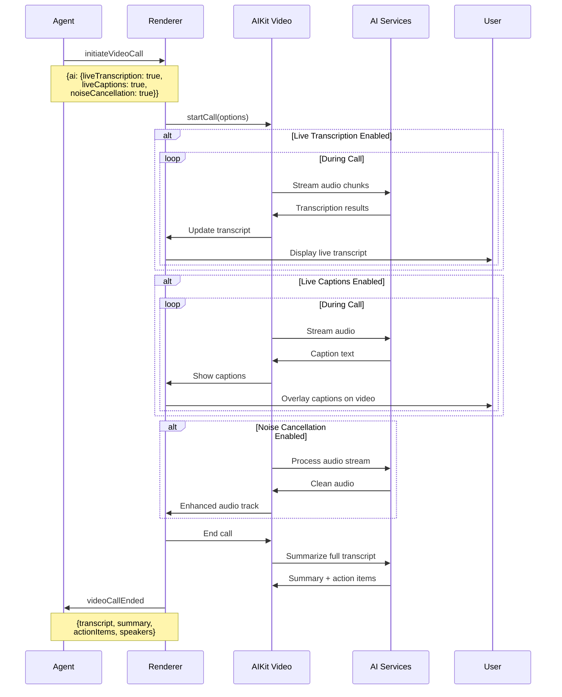
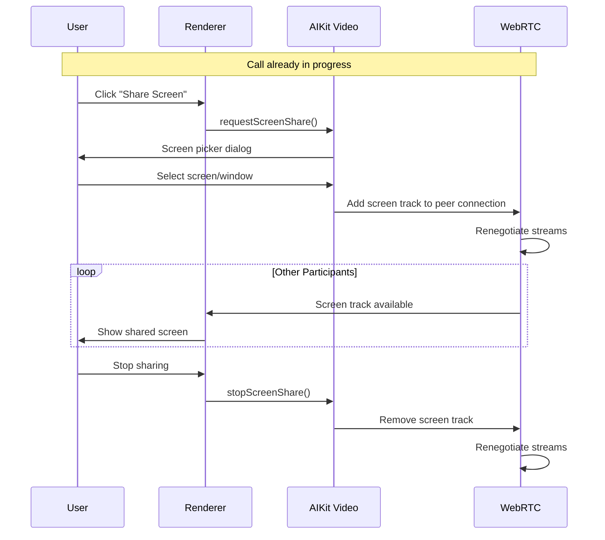
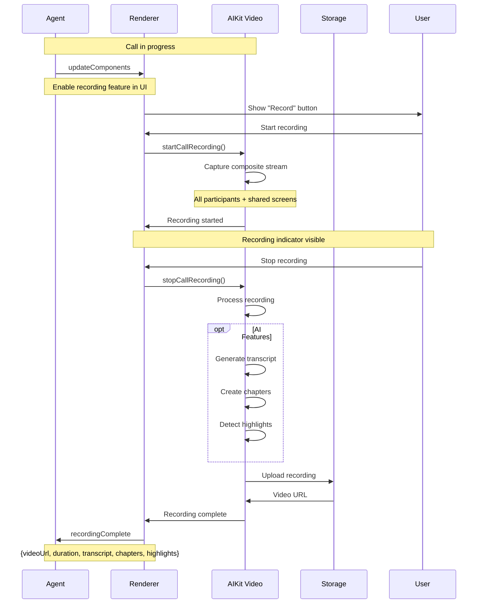
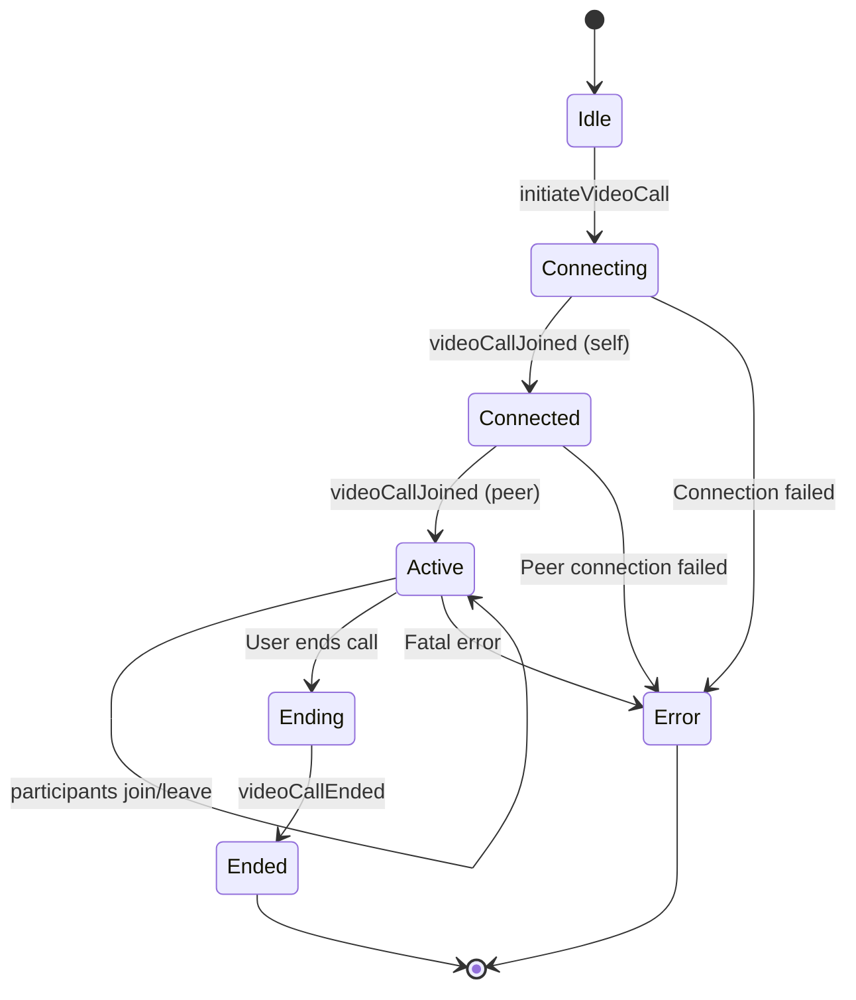
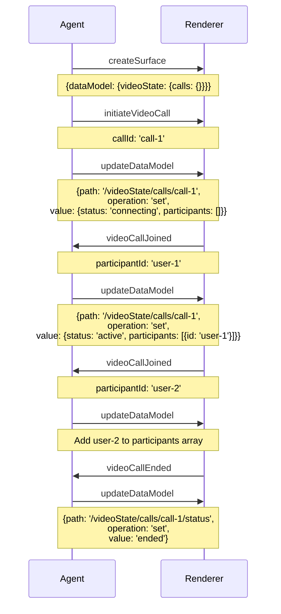
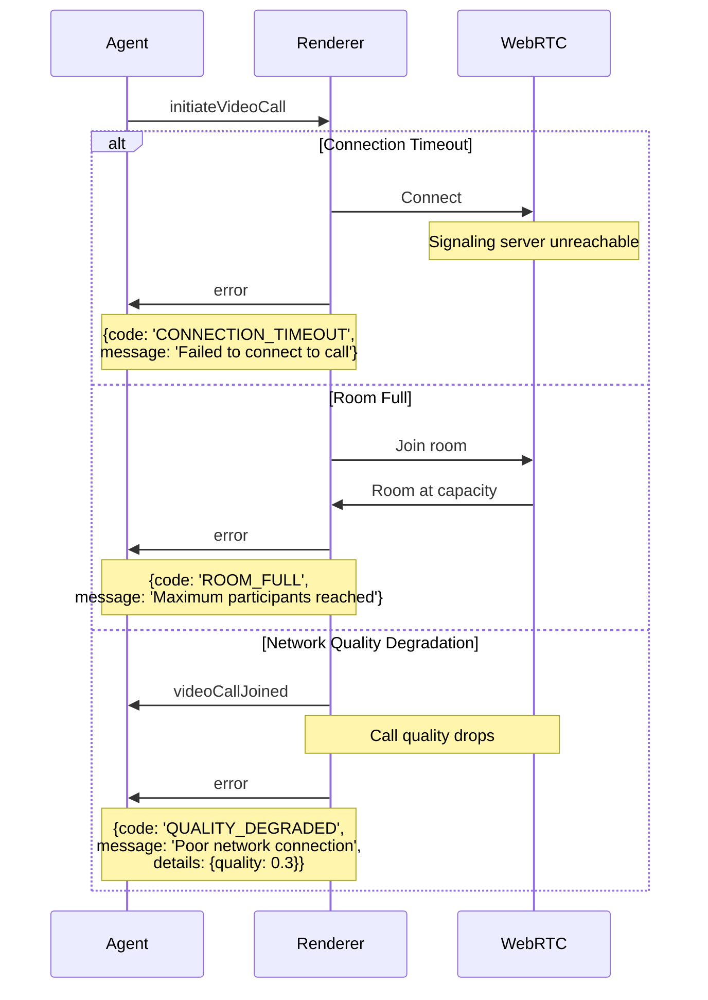
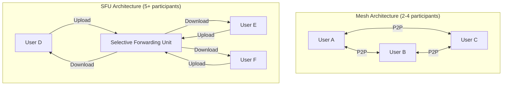

# Video Call Protocol Flow

**Version**: 0.10.0-alpha
**Last Updated**: 2026-02-08
**Status**: Specification

## Overview

This document specifies the WebSocket message flow for the A2UI Video Call protocol. The call flow enables agents to initiate real-time video conferencing sessions, manage participants, and receive AI-generated call metadata (transcripts, summaries, action items).

## Message Types

The video call flow uses three primary message types:

1. **A2UIInitiateVideoCall** (Agent → Renderer) - Creates a video call room
2. **A2UIVideoCallJoined** (Renderer → Agent) - Confirms participant joined
3. **A2UIVideoCallEnded** (Renderer → Agent) - Delivers call results with metadata

## Basic Video Call Flow



## Multi-Participant Call Flow



## Call with AI Features

When AI features are enabled, AIKit Video provides real-time enhancements:



## Screen Sharing During Call



## Recording a Video Call



## Call State Transitions



## Data Model Updates

The agent can track call state via the data model:



## Message Schemas

### A2UIInitiateVideoCall

```typescript
interface A2UIInitiateVideoCall extends A2UIMessage {
  type: 'initiateVideoCall'
  surfaceId: string
  callId: string
  roomId: string           // WebRTC room identifier
  participants?: string[]  // Optional initial participant list
  features?: {
    chat?: boolean         // Enable text chat (default: false)
    screenShare?: boolean  // Allow screen sharing (default: true)
    recording?: boolean    // Allow call recording (default: false)
  }
  layout?: 'grid' | 'speaker' | 'sidebar'  // UI layout hint
  ai?: {
    liveTranscription?: boolean   // Real-time transcription
    liveCaptions?: boolean        // Live caption overlay
    translation?: string          // Target language code (e.g., 'es', 'fr')
    noiseCancellation?: boolean   // AI noise removal
    speakerIdentification?: boolean  // Identify speakers in transcript
    actionItemDetection?: boolean    // Auto-detect action items
    zerodb?: boolean              // Auto-store call data in ZeroDB
  }
}
```

### A2UIVideoCallJoined

```typescript
interface A2UIVideoCallJoined extends A2UIMessage {
  type: 'videoCallJoined'
  surfaceId: string
  callId: string
  participantId: string    // User ID of participant
  timestamp: string        // ISO 8601 timestamp
  metadata?: {
    displayName?: string
    isLocal?: boolean      // True if this is the local user
    deviceInfo?: {
      camera?: string
      microphone?: string
    }
  }
}
```

### A2UIVideoCallEnded

```typescript
interface A2UIVideoCallEnded extends A2UIMessage {
  type: 'videoCallEnded'
  surfaceId: string
  callId: string
  duration: number         // Call duration in seconds
  endedBy?: string         // Participant ID who ended the call
  reason?: 'user_ended' | 'timeout' | 'error' | 'all_left'

  // AI-generated fields (if AI enabled)
  transcript?: string
  transcriptSegments?: Array<{
    speaker: string
    text: string
    timestamp: number
  }>
  summary?: string
  actionItems?: string[]
  topics?: string[]
  sentiment?: 'positive' | 'neutral' | 'negative'

  // Call statistics
  stats?: {
    peakParticipants?: number
    averageQuality?: number     // 0-1
    totalDataTransferred?: number  // Bytes
    screenShareDuration?: number   // Seconds
  }
}
```

## Error Handling

See [error-handling-flow.md](./error-handling-flow.md) for comprehensive error scenarios.

Quick examples:



## Implementation Notes

### For Agent Developers

1. Use consistent `roomId` for all participants in same call
2. Generate unique `callId` per user's call instance
3. Handle participant join/leave events to update UI
4. Monitor call quality metrics and inform users
5. AI features (especially live transcription) add latency and cost
6. Consider implementing call timeouts for resource management

### For Renderer Implementers

1. Use AIKit Video's `VideoCall` component for implementation
2. Handle WebRTC signaling through AIKit Video's signaling server
3. Implement reconnection logic for network interruptions
4. Support multiple video layouts (grid, speaker, sidebar)
5. Enable adaptive bitrate based on network conditions
6. Implement echo cancellation and audio level monitoring
7. Handle screen sharing as additional video track

### Performance Considerations

- **WebRTC overhead**: ~1-3 Mbps per participant (video + audio)
- **CPU usage**: Scales with participant count (encoding/decoding)
- **Grid layout**: Shows all participants, high bandwidth
- **Speaker layout**: Shows active speaker, lower bandwidth
- **AI transcription**: Adds ~200ms latency, requires backend processing
- **Screen sharing**: Additional 1-5 Mbps depending on content

### Quality Optimization

1. **Adaptive bitrate**: Reduce quality on poor networks
2. **Simulcast**: Send multiple quality layers, let receivers choose
3. **Voice detection**: Reduce bandwidth when not speaking
4. **Bandwidth estimation**: Monitor and adjust in real-time
5. **Codec selection**: VP9 (better quality) vs VP8 (better compatibility)

## Browser Compatibility

| Feature | Chrome | Firefox | Safari | Edge |
|---------|--------|---------|--------|------|
| WebRTC video call | ✅ | ✅ | ✅ | ✅ |
| Screen sharing | ✅ | ✅ | ✅ 13+ | ✅ |
| Audio/Video | ✅ | ✅ | ✅ | ✅ |
| VP9 codec | ✅ | ✅ | ❌ | ✅ |
| Simulcast | ✅ | ⚠️ Limited | ⚠️ Limited | ✅ |

## WebRTC Architecture

AIKit Video uses a configurable WebRTC architecture:



- **Mesh (P2P)**: Low latency, scales to ~4 participants
- **SFU**: Better scalability, supports 10+ participants
- **MCU**: Server-side mixing, highest scalability (future)

## Security Considerations

1. **DTLS-SRTP**: All media encrypted end-to-end
2. **Room authentication**: Validate participants before joining
3. **Token-based access**: Use JWT tokens for room access
4. **Permissions**: Verify camera/mic permissions
5. **Recording consent**: Notify all participants when recording

## Related Documents

- [Recording Protocol Flow](./recording-protocol-flow.md)
- [Video Generation Protocol Flow](./video-generation-protocol-flow.md)
- [Error Handling Flow](./error-handling-flow.md)
- [Video Protocol PRD](../planning/video-protocol-prd.md)
