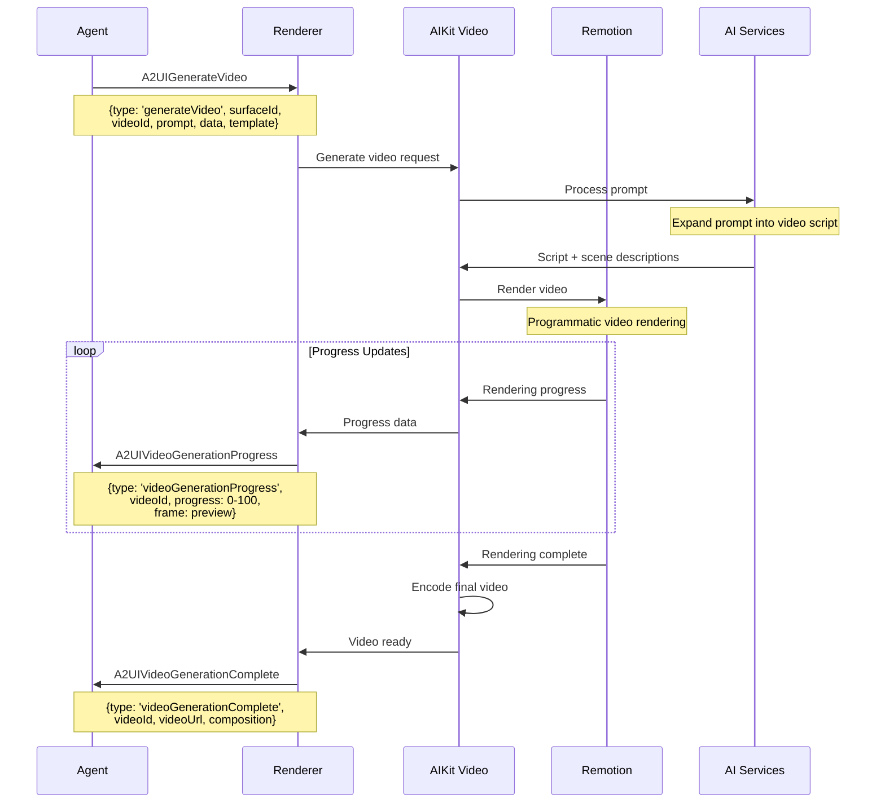
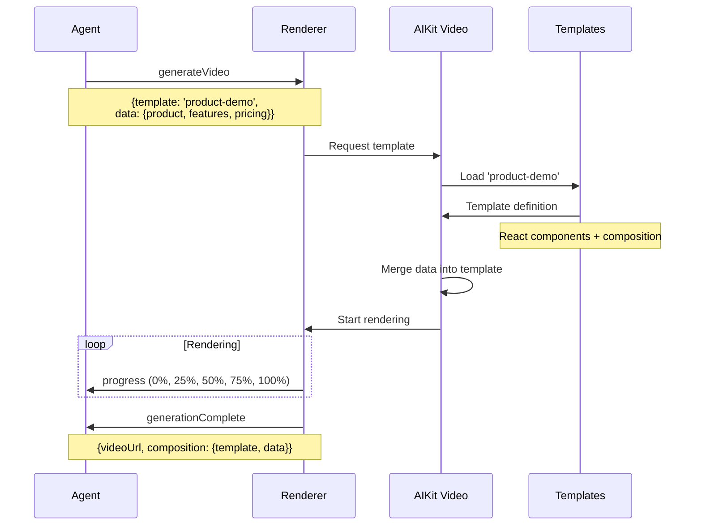
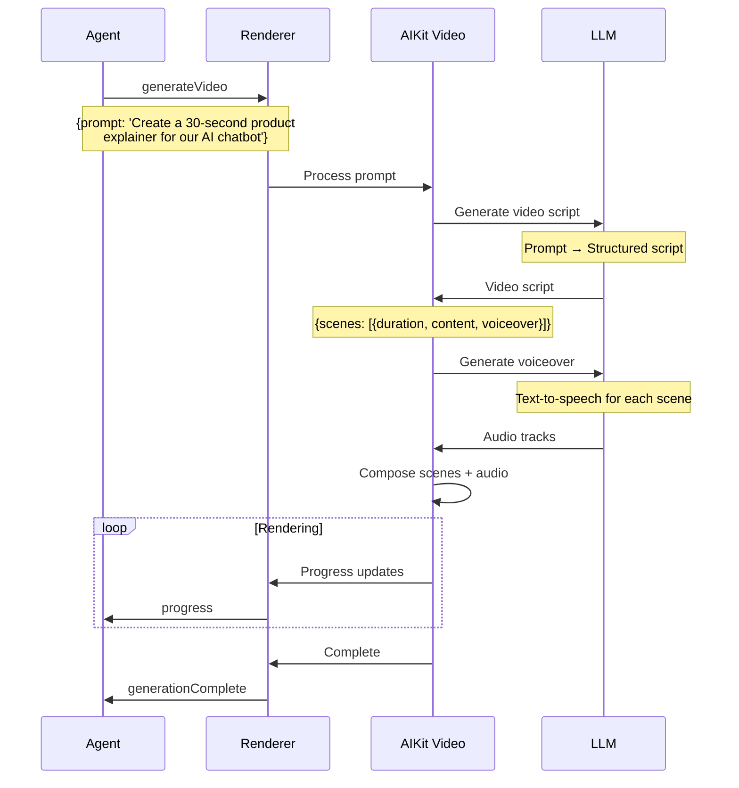
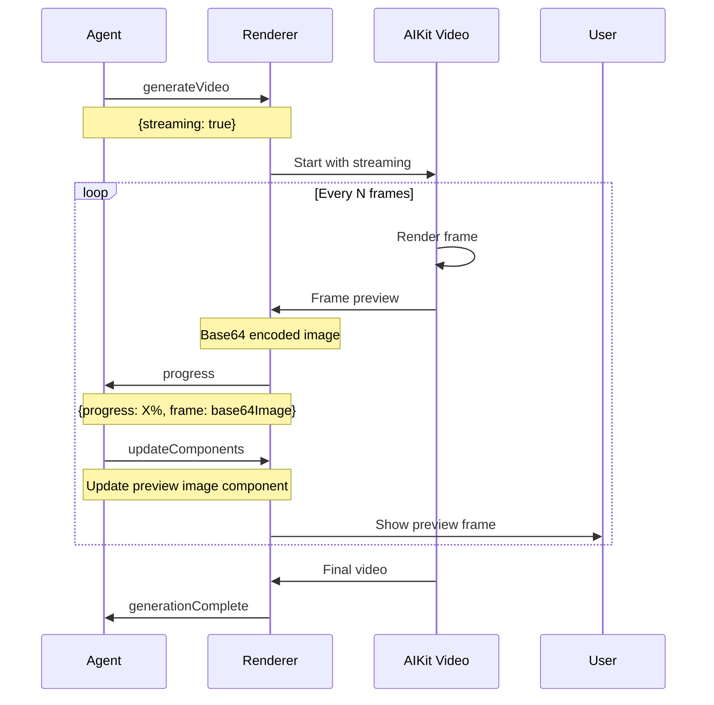
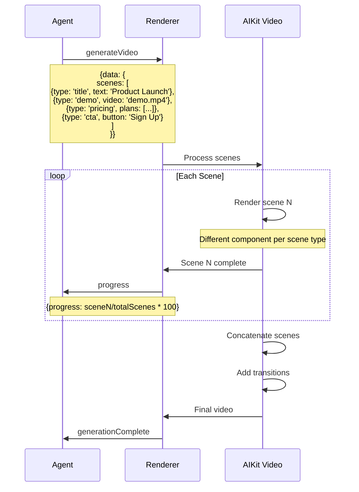
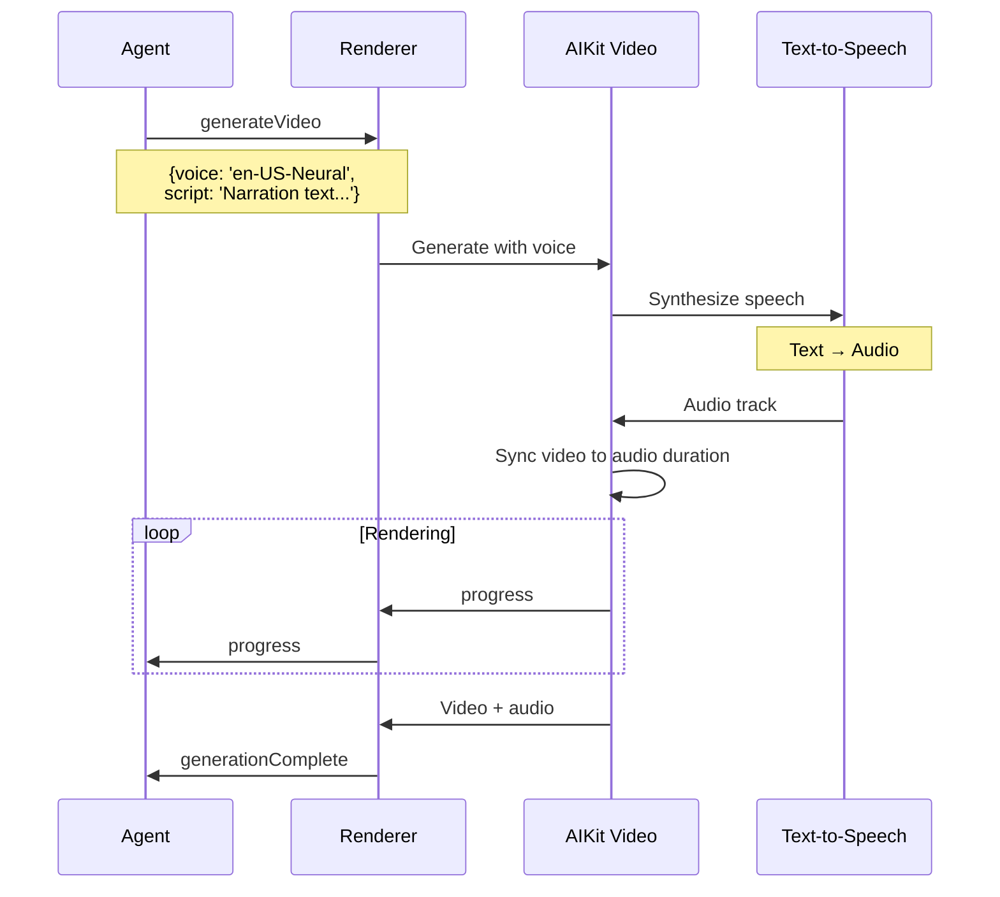
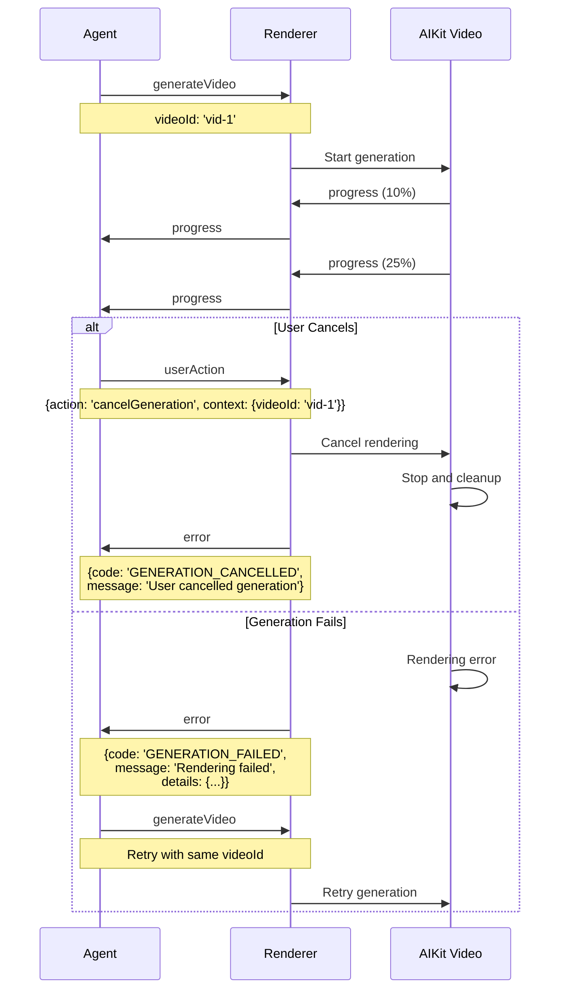
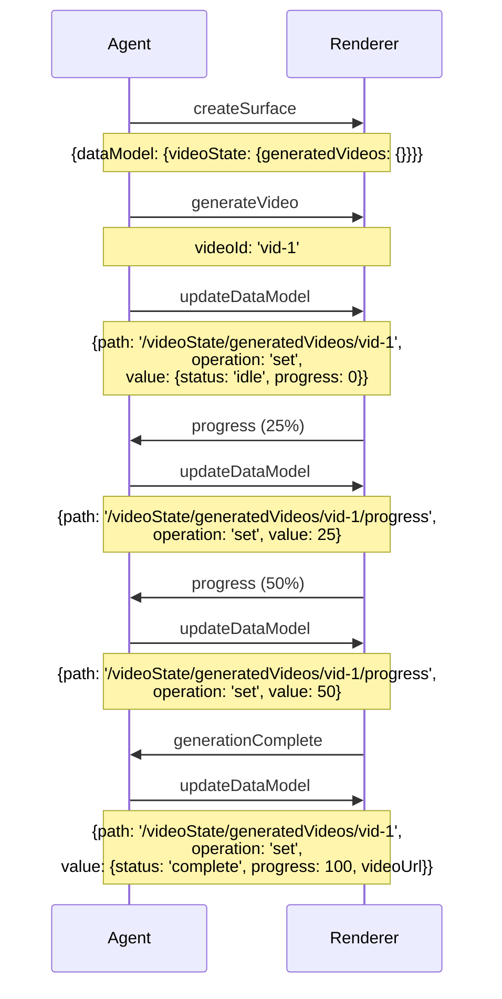
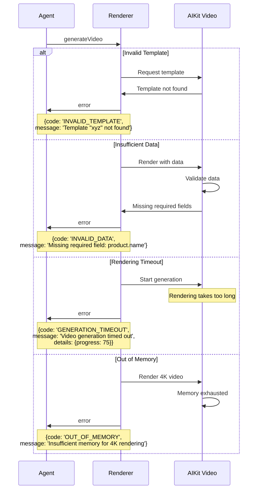

# Video Generation Protocol Flow

**Version**: 0.10.0-alpha
**Last Updated**: 2026-02-08
**Status**: Specification

## Overview

This document specifies the WebSocket message flow for the A2UI Video Generation protocol. The generation flow enables agents to create AI-generated videos using templates, prompts, and data, with real-time progress updates.

## Message Types

The video generation flow uses three primary message types:

1. **A2UIGenerateVideo** (Agent → Renderer) - Initiates video generation
2. **A2UIVideoGenerationProgress** (Renderer → Agent) - Streams progress updates
3. **A2UIVideoGenerationComplete** (Renderer → Agent) - Delivers finished video

## Basic Video Generation Flow



## Template-Based Generation



## Prompt-Based Generation



## Streaming Preview Mode

When `streaming: true` is enabled, preview frames are sent during generation:



## Multi-Scene Video Generation



## Voice Synthesis Integration



## Retry and Cancellation Flow



## Data Model Updates

The agent can track generation state via the data model:



## Message Schemas

### A2UIGenerateVideo

```typescript
interface A2UIGenerateVideo extends A2UIMessage {
  type: 'generateVideo'
  surfaceId: string
  videoId: string

  // Generation mode (choose one)
  prompt?: string          // AI generates from natural language
  template?: string        // Use predefined template

  // Template data
  data?: Record<string, any>

  // Options
  options?: {
    duration?: number      // Target duration in seconds
    resolution?: string    // '1080p' | '720p' | '4k'
    fps?: number           // Frames per second (default: 30)
    aspectRatio?: string   // '16:9' | '9:16' | '1:1'
  }

  // Voice options
  voice?: {
    engine?: string        // TTS engine ('neural', 'standard')
    voiceId?: string       // Voice identifier
    script?: string        // Narration text
  }

  // Streaming options
  streaming?: boolean      // Send preview frames during generation

  // Composition override
  composition?: {
    scenes?: Array<{
      type: string
      duration: number
      props: Record<string, any>
    }>
    transitions?: 'fade' | 'slide' | 'none'
    audio?: {
      backgroundMusic?: string
      volume?: number
    }
  }
}
```

### A2UIVideoGenerationProgress

```typescript
interface A2UIVideoGenerationProgress extends A2UIMessage {
  type: 'videoGenerationProgress'
  surfaceId: string
  videoId: string
  progress: number         // 0-100

  // Optional preview frame (if streaming enabled)
  frame?: string          // Base64 encoded image

  // Optional stage info
  stage?: string          // 'preparing' | 'rendering' | 'encoding' | 'finalizing'

  // Estimated time remaining
  eta?: number            // Seconds

  // Current frame number
  currentFrame?: number
  totalFrames?: number
}
```

### A2UIVideoGenerationComplete

```typescript
interface A2UIVideoGenerationComplete extends A2UIMessage {
  type: 'videoGenerationComplete'
  surfaceId: string
  videoId: string
  videoUrl: string        // Final video URL

  // Video metadata
  metadata?: {
    duration: number      // Actual duration in seconds
    resolution: string    // e.g., '1920x1080'
    fps: number
    fileSize: number      // Bytes
    format: string        // 'mp4' | 'webm'
    codec: string
  }

  // Composition data (for reproducing/editing)
  composition: {
    template?: string
    data?: Record<string, any>
    scenes?: Array<any>
    prompt?: string       // Original prompt if generated
  }

  // Rendering statistics
  stats?: {
    renderTime: number    // Seconds to render
    framesRendered: number
    audioTracks: number
    videoTracks: number
  }
}
```

## Error Handling

See [error-handling-flow.md](./error-handling-flow.md) for comprehensive error scenarios.

Quick examples:



## Implementation Notes

### For Agent Developers

1. Always generate unique `videoId` values (UUID recommended)
2. Provide meaningful progress updates to users (0-100%)
3. Handle long generation times (30-120 seconds typical)
4. Consider streaming mode for better UX during generation
5. Store `composition` data for video editing/regeneration
6. Implement cancellation for user-initiated stops
7. Template-based generation is faster than prompt-based

### For Renderer Implementers

1. Use AIKit Video's `AIVideo` component for implementation
2. Leverage Remotion for programmatic video rendering
3. Implement progress estimation based on frame count
4. Use web workers for rendering to avoid blocking UI
5. Stream preview frames at reasonable intervals (every 10-20 frames)
6. Cache templates for faster subsequent generations
7. Implement retry logic for transient failures
8. Consider server-side rendering for complex videos

### Performance Considerations

- **1080p video**: 30-60 seconds generation time (30 sec video)
- **720p video**: 15-30 seconds generation time (30 sec video)
- **4K video**: 2-5 minutes generation time (30 sec video)
- **Prompt-based**: Adds 5-15 seconds for AI script generation
- **Voice synthesis**: Adds 2-10 seconds depending on length
- **Complex templates**: Slower rendering (effects, animations)
- **Streaming mode**: 10-20% overhead for preview generation

### Template Categories

Common template types in AIKit Video:

1. **Product Demo**: Showcase product features
2. **Explainer Video**: Educational content
3. **Social Media**: Short-form vertical videos
4. **Presentation**: Slide-based content
5. **Testimonial**: Customer stories
6. **Tutorial**: Step-by-step guides
7. **Promo**: Marketing videos

### Quality Optimization

1. **Resolution**: Start with 720p for faster iteration
2. **FPS**: 30fps is sufficient for most content (24fps cinematic, 60fps gaming)
3. **Codec**: H.264 for compatibility, H.265 for quality
4. **Bitrate**: Adaptive based on complexity
5. **Caching**: Cache rendered scenes for reuse

## Advanced Features

### Dynamic Data Binding

Templates can reference data model fields:

```typescript
// Agent sends
{
  template: 'product-demo',
  data: {
    product: {
      name: '/dataModel/currentProduct/name',    // JSON Pointer
      price: '/dataModel/currentProduct/price'
    }
  }
}

// Renderer resolves pointers from data model before rendering
```

### Composition Reuse

Agents can edit existing videos by modifying composition:

```typescript
// Original generation
{
  videoId: 'vid-1',
  template: 'explainer',
  data: { title: 'Version 1' }
}

// Edit and regenerate
{
  videoId: 'vid-2',
  composition: {
    template: 'explainer',
    data: { title: 'Version 2' },  // Modified data
    scenes: previousComposition.scenes  // Reuse scenes
  }
}
```

## Browser Compatibility

| Feature | Chrome | Firefox | Safari | Edge |
|---------|--------|---------|--------|------|
| Video generation | ✅ | ✅ | ✅ | ✅ |
| Canvas rendering | ✅ | ✅ | ✅ | ✅ |
| WebCodecs | ✅ 94+ | ❌ | ❌ | ✅ 94+ |
| OffscreenCanvas | ✅ | ✅ | ✅ 16.4+ | ✅ |

Note: Server-side rendering recommended for production use (no browser limitations)

## Related Documents

- [Recording Protocol Flow](./recording-protocol-flow.md)
- [Video Call Protocol Flow](./video-call-protocol-flow.md)
- [Error Handling Flow](./error-handling-flow.md)
- [Video Protocol PRD](../planning/video-protocol-prd.md)
